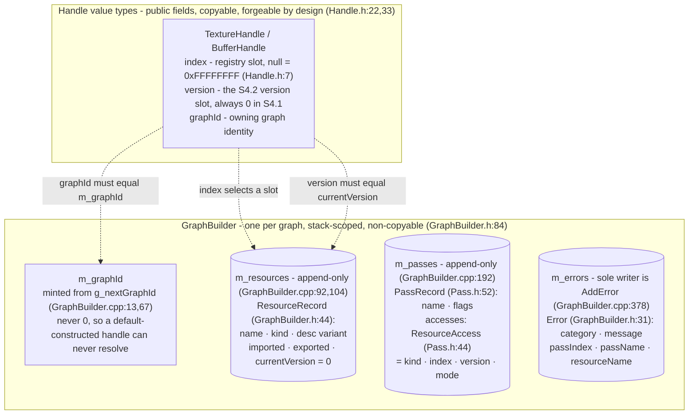
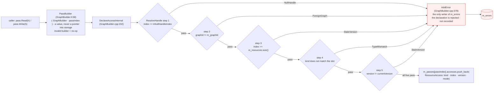
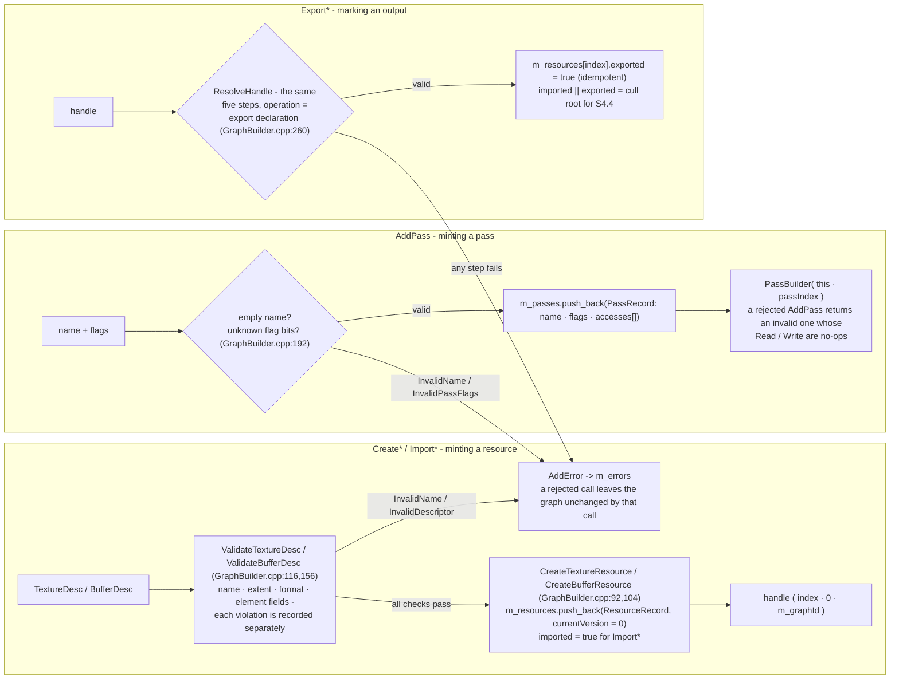
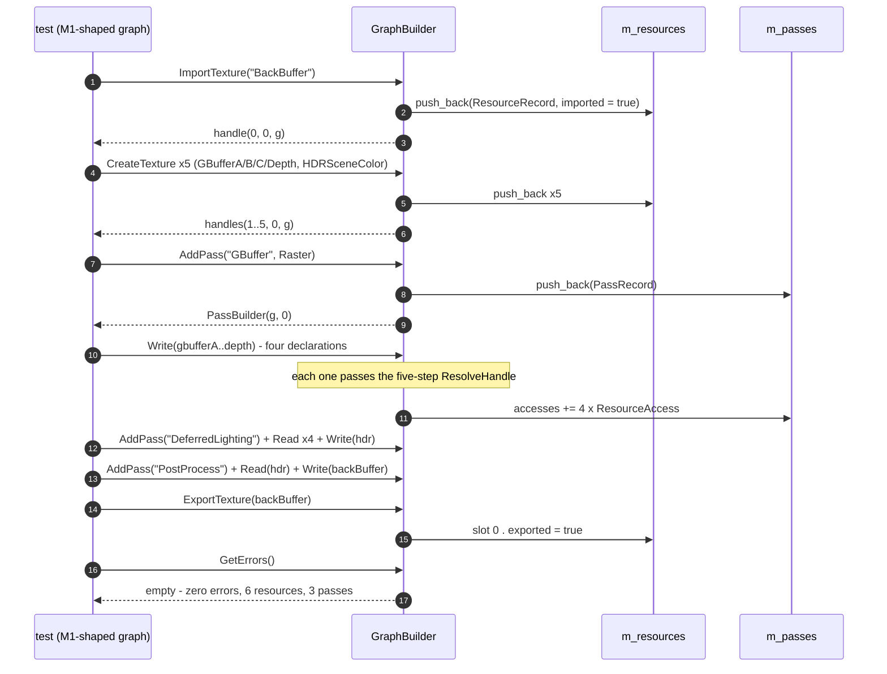

# RDG S4.1 Data Flow Walkthrough

Status: **reference walkthrough** — diagrams pinned to the code at commit
`35846e2`. This is a historical S4.1 snapshot, not the current S4.2 field or
method map. S4.2 adds version records, returning Write calls, access validation,
and a provenance dump; the current API contract is in [`rdg.md`](rdg.md).

This is the picture behind [`rdg.md`](rdg.md): who owns what, how one
declaration travels through validation into storage, and which method touches
which member. Every arrow below can be checked against a `file:line` in §6.
The model itself — semantics, failure taxonomy, boundary — is defined in
[`rdg.md`](rdg.md); this file only draws it.

## 1. Ownership and identity

Three things this picture fixes:

- **A handle is not a pointer.** It is three `uint32`s that only mean
  something when checked against the owning builder's stores — that is why
  validation, not encapsulation, is the safety net.
- **The two record stores are append-only.** Indices are never recycled
  within a graph, so `version` is the only staleness axis — the precondition
  S4.2's write-mints-new-handle semantics depends on.
- **`ResourceAccess.version` is the handle's version pinned at declaration
  time**, not a live view — the evidence trail S4.2 needs to reject use of a
  superseded version.

## 2. The declaration flow (Read / Write)

The core path. Every `Read`/`Write` on a `PassBuilder` funnels into the same
five-step waterfall; the order is a contract (earliest category wins), not an
implementation detail.

Two properties visible here:

- **Rejection is per-declaration.** A bad handle rejects exactly that one
  declaration; the surrounding graph stays explorable (the
  per-declaration-rejection test asserts this).
- **Out-of-range and version-mismatch share `StaleVersion`** by design: with
  a correct `graphId` an out-of-range index can only be forged, which is the
  same "does not resolve to the current slot" condition.

## 3. The other three flows

All four entry surfaces (`Create*`, `AddPass`, `Read`/`Write`, `Export*`)
share one error sink and one rule: validate immediately, reject the single
call, keep collecting.

## 4. One complete construction, end to end

The M1-shaped graph from `tests/test_rdg_declarations.cpp` as a timeline:

## 5. Field access matrix

Direct member access per method (asterisk = routed through `AddError`, the
only direct writer of `m_errors`). `R` = read, `W` = write.

### GraphBuilder

| Method (`GraphBuilder.cpp`) | `m_graphId` | `m_resources` | `m_passes` | `m_errors` |
|---|---|---|---|---|
| constructor (:67) | **W** — minted from `g_nextGraphId` | | | |
| `GetGraphId` (GraphBuilder.h:92) | R | | | |
| `CreateTextureResource` / `CreateBufferResource` (:92, :104) | R — minted into the handle | **W** — push_back | | |
| `ValidateTextureDesc` / `ValidateBufferDesc` (:116, :156) | | | | W* |
| `AddPass` (:192) | | | **W** — push_back | W* |
| `ResolveHandle` (:270) | R | R — size + entry | | W* |
| `DeclareAccessInternal` (:232) | | (R — via ResolveHandle) | **RW** — reads pass name, appends access | W* |
| `ExportResource` (:260) | (R — via ResolveHandle) | **RW** — R via ResolveHandle, writes `exported` | | W* |
| `AddError` (:378) | | | | **W** — sole direct writer |
| `GetErrors` / `AssertNoErrors` (h:104, :361) | | | | R |
| `GetPassCount` / `GetPass` (h:107, :366) | | | R | |
| `GetResourceCount` / `GetResource` (h:109, :372) | | R | | |

### PassBuilder

| Method | `m_builder` | `m_passIndex` |
|---|---|---|
| `IsValid` (GraphBuilder.h:61) | R | |
| `PassIndex` (GraphBuilder.h:62) | | R |
| `Read` / `Write` (four overloads, GraphBuilder.cpp:35–64) | R — forwards to `DeclareAccess` | R |

The remaining types are plain data with at most one accessor: `IsNull` reads
`index` (Handle.h:28,39); descriptors, records, and `Error` have no methods.

## 6. Invariants the diagrams make visible

1. **Append-only stores** — indices never recycle within a graph, so version
   is the only staleness axis (S4.2's precondition).
2. **`ResolveHandle` is the single validation gate** — Read, Write, and
   Export share one five-step chain, so the failure taxonomy is identical at
   every entry point.
3. **`AddError` is the only writer of `m_errors`** — errors are collected
   data, never control flow.
4. **Rejection is per-call** — one bad declaration never poisons the
   surrounding graph.
5. **`PassBuilder` holds (builder, index)** — never a pointer into storage
   that can reallocate when another pass is appended.

## 7. Source index

| Diagram element | Source |
|---|---|
| Handle fields, null sentinel | `src/rdg/Handle.h:7,22–41` |
| Neutral `Format`, descriptors, `operator==` | `src/rdg/ResourceDesc.h` |
| `PassFlags`, `AccessMode`, `ResourceAccess`, `PassRecord` | `src/rdg/Pass.h` |
| `ErrorCategory`, `Error`, `ResourceRecord`, `PassBuilder`, `GraphBuilder` | `src/rdg/GraphBuilder.h` |
| Graph-id counter, validation chain, error construction | `src/rdg/GraphBuilder.cpp` |
| Failure-matrix and M1-shaped-graph tests | `tests/test_rdg_handles.cpp`, `tests/test_rdg_declarations.cpp` |
