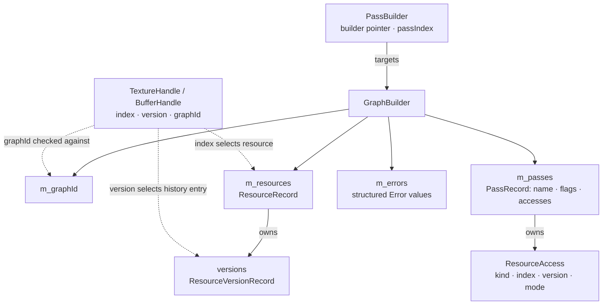
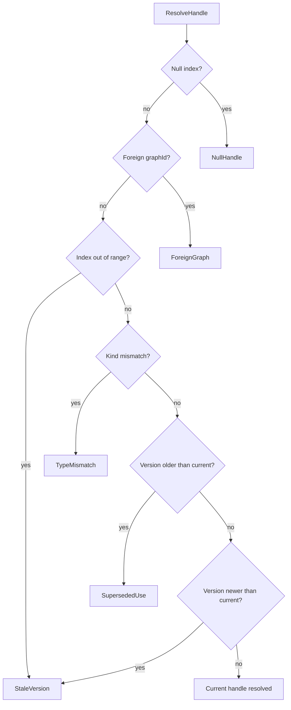
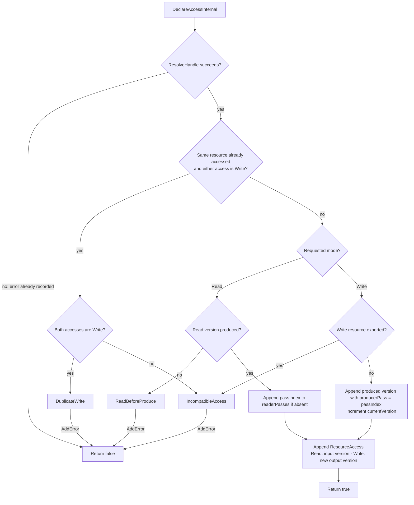
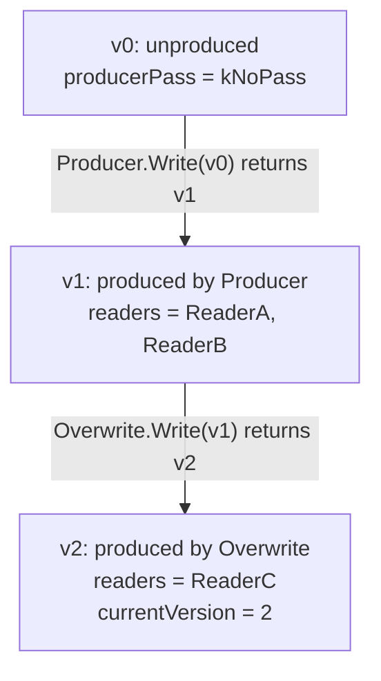
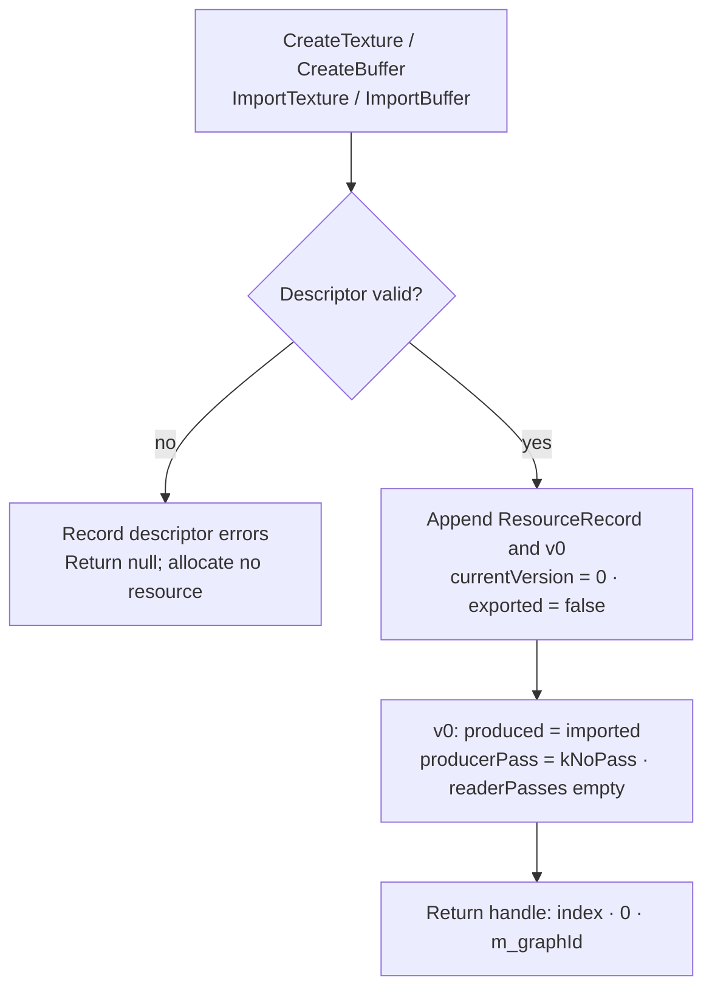
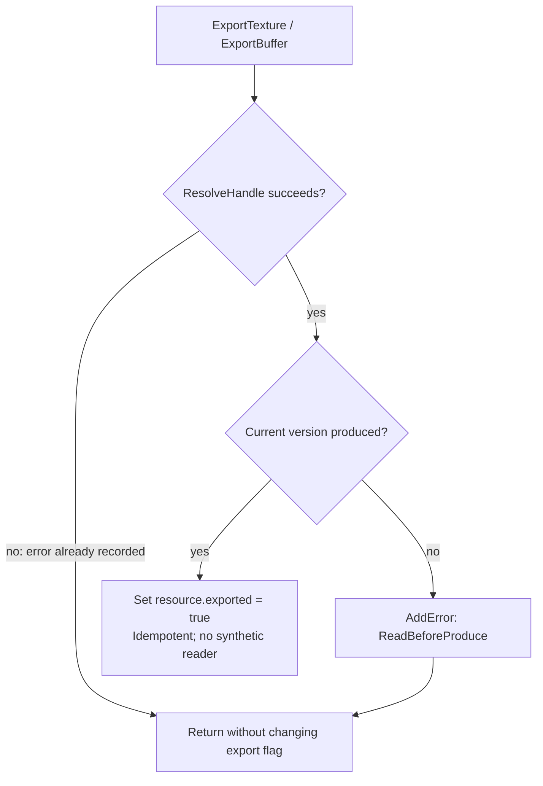
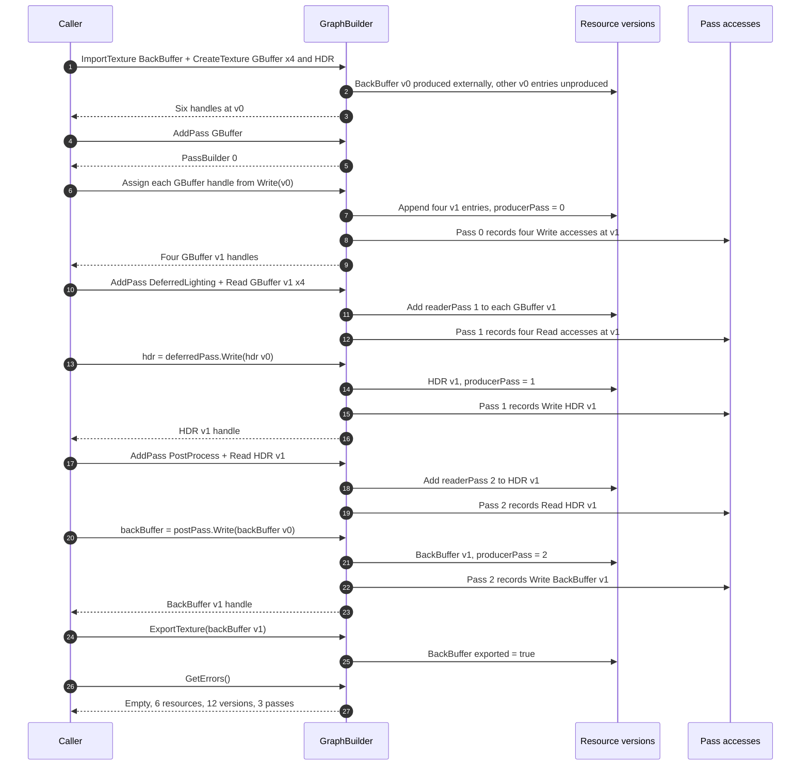

# RDG S4.2 Data Flow Walkthrough

Status: **current implementation walkthrough** — checked against S4.2 commit
`b47923c` (2026-09-09). The original S4.1 diagrams remain in Git history.

This file explains how declarations change the CPU model. The normative
semantics and failure taxonomy live in [rdg.md](rdg.md); the ownership boundary
lives in [ADR-003](adr/ADR-003-rdg-boundary.md). Method and field names below
refer to the [source index](#8-source-index), without hard-coded line numbers.

The Mermaid blocks render on GitHub. A local Markdown viewer needs Mermaid
support enabled; a source editor displays the diagram code.

## 1. Ownership and version identity



Resource indices are shared by textures and buffers and never recycled.
`ResourceRecord` retains the descriptor, kind, name, imported/exported flags,
`currentVersion`, and an append-only `versions` vector. Each version stores:

| Field | Meaning |
|---|---|
| `produced` | Whether contents have a declared source |
| `producerPass` | One producer pass index, or `Error::kNoPass` for v0 |
| `readerPasses` | Unique pass indices, in first-read declaration order |

| Initial version | `produced` | `producerPass` | Allowed uses |
|---|---|---|---|
| `Create*` v0 | false | `Error::kNoPass` | Write |
| `Import*` v0 | true | `Error::kNoPass` (external source) | Read, Write, Export |
| Written v1+ | true | Declaring pass index | Read, Write from another pass, Export |

The allowed uses also require a current handle and compatible pass accesses.
An exported version cannot be overwritten.

`PassBuilder` holds an index, not a pointer into `m_passes`, so appending
passes does not change which pass it targets. Default/rejected builders
perform no mutations: Read returns void, Write returns a null handle.

## 2. Handle validation before every access

Read, Write, and Export all call `ResolveHandle`. Validation stops at the
first failing check, before modifying versions or accepted declarations.



The last two decisions depict the single version-mismatch branch in the
implementation. Out-of-range indices and forged future versions report
`StaleVersion`; an older version reports `SupersededUse`.

All rejected paths call `AddError`, which records category, message, pass
identity (when applicable), and resource name (when resolvable). Export uses
`Error::kNoPass`. Validation failures leave existing graph data intact.

## 3. Read and Write declaration flow

The texture and buffer overloads use the same internal validation and storage.

| Public entry | Forwarding path |
|---|---|
| `PassBuilder::Read(handle)` | `DeclareAccess(Read)` → `DeclareAccessInternal` |
| `PassBuilder::Write(handle)` | `DeclareWrite` → `DeclareAccess(Write)` → `DeclareAccessInternal` |

Once the handle resolves, `DeclareAccessInternal` checks same-pass conflicts
before checking whether a read is produced or a write targets an exported resource.



On success, `DeclareWrite` returns a handle with the original resource index,
the new `currentVersion`, and the owning graph ID. On failure it returns null.
Callers must retain the result:

```cpp
hdrSceneColor = deferredPass.Write(hdrSceneColor);
postPass.Read(hdrSceneColor);
```

Read declarations may repeat: every accepted call adds a `ResourceAccess`,
but each pass appears only once in the version's reader list. A pass cannot
read and write the same resource in either order, nor write it twice.

Handle validation wins over access conflicts: repeating Write with the old
input handle reports `SupersededUse`; repeating with the returned current
handle reports `DuplicateWrite`.

## 4. Version history across overwrites

This example starts with an internal allocation. Each arrow denotes a
successful Write call, not a compiled scheduling edge.



ReaderA and ReaderB declared their reads before the overwrite. Their v1
accesses and v1's producer/readers remain stored after v2 is created.
Subsequent Read, Write, or Export calls using v0 or v1 fail.

Write declares a whole-resource overwrite; it does not implicitly read the
previous version. The predecessor of vn is v(n-1), so retained history gives
S4.3 the producer and readers needed to derive RAW/WAR/WAW dependencies.

Versions advance in **declaration-call order**, not pass-index order.
An older `PassBuilder` can read a version already produced by a newer pass.
S4.2 does not build scheduling edges, topologically sort, or detect cycles;
successful declaration validation alone does not guarantee schedulability.
No GPU allocation, copy, or barrier occurs here.

## 5. Creation, pass registration, and export

### Resource creation and import



`ValidateTextureDesc` and `ValidateBufferDesc` collect descriptor errors
before resource registration. For AddPass, name and known flag bits are
validated before appending `PassRecord{name, flags, empty accesses}`.
Failure returns an invalid `PassBuilder`; success returns a builder bound
to the new pass index.

### Export pins a produced final version



Export of internal unproduced v0 fails; imported v0 may be exported directly.
After export, new reads and repeated export remain legal, while writes fail
with `IncompatibleAccess` (unless an earlier validation check fails).
Because writes cannot supersede the exported version, the resource-level flag
unambiguously refers to `currentVersion`. The `imported || exported` root
policy is retained for S4.4; no culling runs in S4.2.

## 6. M1-shaped construction and its dump

The example follows `RunRdgDeclarationTests`. GBuffer shorthand means four
separate resources: A, B, C, and Depth. Every Write call returns a typed handle.



`DumpVersions()` reads the resources and pass names without modifying the
graph. Rows follow resource-index then version order; reader order follows
first accepted read declarations. Graph IDs are omitted.

For that construction, the full dump is:

```text
texture 0 'BackBuffer' v0 producer=external readers=[]
texture 0 'BackBuffer' v1 producer=2 'PostProcess' readers=[] current exported
texture 1 'GBufferA' v0 producer=unproduced readers=[]
texture 1 'GBufferA' v1 producer=0 'GBuffer' readers=[1 'DeferredLighting'] current
texture 2 'GBufferB' v0 producer=unproduced readers=[]
texture 2 'GBufferB' v1 producer=0 'GBuffer' readers=[1 'DeferredLighting'] current
texture 3 'GBufferC' v0 producer=unproduced readers=[]
texture 3 'GBufferC' v1 producer=0 'GBuffer' readers=[1 'DeferredLighting'] current
texture 4 'GBufferDepth' v0 producer=unproduced readers=[]
texture 4 'GBufferDepth' v1 producer=0 'GBuffer' readers=[1 'DeferredLighting'] current
texture 5 'HDRSceneColor' v0 producer=unproduced readers=[]
texture 5 'HDRSceneColor' v1 producer=1 'DeferredLighting' readers=[2 'PostProcess'] current
```

Every consumed version has a declared source. This is a provenance dump,
not an execution trace; S4.6 will add compiled-graph text/DOT diagnostics.

## 7. Field access matrix

`R` = read, `W` = write. A dash means no direct access. `W*` means
indirect error collection via `AddError`. Forwarded operations are shown
separately so a wrapper is not mistaken for the owner of a mutation.

### GraphBuilder

| Method | `m_graphId` | `m_resources` | `m_passes` | `m_errors` |
|---|---|---|---|---|
| Constructor | W | — | — | — |
| `Create*Resource` | R | W: append resource and v0 | — | W* via descriptor validation |
| `Validate*Desc` | — | — | — | W* |
| `AddPass` | — | — | RW: size and append | W* |
| `ResolveHandle` | R | R: range, kind, currentVersion | — | W* |
| `DeclareWrite` | R | R: currentVersion after success | — | Via `DeclareAccess` |
| `DeclareAccessInternal` | — | RW: produced/exported checks, versions, readers | RW: name, conflicts, append access | W* |
| `ExportResource` | — | RW: produced check, exported flag | — | W* |
| `DumpVersions` | — | R: all version records and names | R: producer/reader names | — |
| `AddError` | — | — | — | W: sole writer |
| `GetGraphId` | R | — | — | — |
| `GetResourceCount` / `GetResource` | — | R | — | — |
| `GetPassCount` / `GetPass` | — | — | R | — |
| `GetErrors` / `AssertNoErrors` | — | — | — | R |

`Create*`/`Import*`, `DeclareAccess`, and `ExportTexture`/`ExportBuffer`
forward arguments to the internal methods without directly accessing stores.
`DeclareAccessInternal` and `ExportResource` also read graph identity
indirectly through `ResolveHandle`. `DeclareWrite` forwards the actual
version mutation to `DeclareAccessInternal`.

### Per-version mutations

| Operation | `currentVersion` | `produced` / `producerPass` | `readerPasses` | Pass access |
|---|---|---|---|---|
| Create / Import | Set to 0 | Initialize v0 from import status / kNoPass | Empty | None |
| Read current version | Unchanged | Unchanged | Add pass if absent | Append Read of input version |
| Write current version | Increment | Append true / declaring pass | Empty for new version | Append Write of new version |
| Export current version | Unchanged | Unchanged | Unchanged | None |
| Rejected call | Unchanged | Unchanged | Unchanged | None appended |

### PassBuilder

| Method | `m_builder` | `m_passIndex` | Result |
|---|---|---|---|
| Constructor | W | W | Bound declaration scope |
| `IsValid` | R | — | Whether builder pointer is non-null |
| `PassIndex` | — | R | Pass identity |
| `Read` overloads | R | R when valid | Forward to `DeclareAccess`; void |
| `Write` overloads | R | R when valid | Forward to `DeclareWrite`; new or null handle |

## 8. Source index

| Diagram or contract | Implementation / evidence |
|---|---|
| Handle identity and null sentinel | [Handle.h](../src/rdg/Handle.h): `TextureHandle`, `BufferHandle` |
| Descriptor shape | [ResourceDesc.h](../src/rdg/ResourceDesc.h) |
| Pass flags and version-pinned access | [Pass.h](../src/rdg/Pass.h): `ResourceAccess`, `PassRecord` |
| Registry and version records | [GraphBuilder.h](../src/rdg/GraphBuilder.h): `ResourceRecord`, `ResourceVersionRecord` |
| Validation, mutations, and text dump | [GraphBuilder.cpp](../src/rdg/GraphBuilder.cpp): methods named above |
| Handle validation | [test_rdg_handles.cpp](../tests/test_rdg_handles.cpp): `RunRdgHandleTests` |
| M1 construction | [test_rdg_declarations.cpp](../tests/test_rdg_declarations.cpp): `RunRdgDeclarationTests` |
| Texture/buffer history, WAW, errors, export, dump | [test_rdg_versioning.cpp](../tests/test_rdg_versioning.cpp): `RunVersionCases` |

S4.2 remains pure CPU code with zero Donut/NVRHI dependencies. Ordering and
cycle detection (S4.3), culling (S4.4), lifetimes (S4.5), and GPU execution
(Stage 5) are outside these diagrams.
