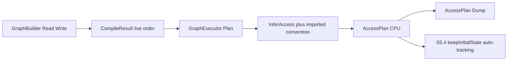

# S5.3 Implement Access-State Planning

> **For agentic workers:** REQUIRED SUB-SKILL: Use superpowers:subagent-driven-development (recommended) or superpowers:executing-plans to implement this plan task-by-task. Steps use checkbox (`- [ ]`) syntax for tracking.

**Goal:** Translate live-pass RDG Read/Write intent into an auditable CPU `AccessPlan` of NVRHI-equivalent states, without recording commands or migrating any raster pass.

**Architecture:** Neutral flag enum `rdg::Access` lives in `RenderLabRdg` (same pattern as `rdg::Format`). `RenderLabRdgExec` infers Access from existing `AccessMode` + format, maps it to `nvrhi::ResourceStates`, and stores per-pass before/required/after plus keepInitialState restore. The one NVRHI path remains `keepInitialState = true` (M1 / S5.2 FormatMap). S5.3 only declares; S5.4 issues by using that tracker.

**Tech Stack:** C++20, CMake preset `windows-vs2022`, `RenderLabDataContractTests` Check() harness, no D3D12 device in CI.

**Saved plan:** Execute this document task-by-task. S5.3 production code lives in `src/rdg` / `src/rdg/exec` and `tests/test_rdg_access.cpp`. Do not start S5.4–S5.7.

---

## Locked grill answers

1. **Enum home:** Neutral `rdg::Access` in `RenderLabRdg` (`Pass.h`, next to `AccessMode`). Exec owns `AccessMap` (`rdg::Access` 鈫?`nvrhi::ResourceStates`). Raster subset only: `ShaderResource`, `RenderTarget`, `DepthWrite`, `Present`, plus `Unknown = 0`. Flag enum + `kKnownAccessBits` / `kWritableMask` / `kReadableMask`. No second Exec access enum.
2. **How a pass states access:** Infer in Exec. Do not extend `ResourceAccess` / `GraphBuilder`. Read 鈫?`ShaderResource`. Write of `D32Float` 鈫?`DepthWrite`. Write of any other known color format 鈫?`RenderTarget`. Buffer write 鈫?unmapped (`Access::Unknown`). `Present` is never inferred from Read/Write.
3. **UAV:** Deferred. No `UnorderedAccess`. Drop the UAV-ordering verification case. Document "where required" as when a real pass needs UAV.
4. **When planned:** Explicit `GraphExecutor::Plan()` one-shot, independent of `Allocate` / `SetDevice` / `RegisterImport`. Failed compile 鈫?`InvalidPass`, empty plan. Second `Plan()` 鈫?`IncompatibleAccess`. Culled passes omitted. `ExecutePass` does not require `Plan()` (S5.1 tests stay green). Query `GetAccessPlan()`.
5. **One NVRHI path:** Declare only. Do not add a command list. Do not call `setTextureState`. Do not flip `FormatMap` `keepInitialState` (stays `true`). S5.4 consumes this plan as the audit of NVRHI auto-tracking. Local PIX agreement is not a ctest.
6. **Imported initial/final:** Convention, `RegisterImport` unchanged. Internals: FormatMap `initialState` as `rdg::Access`, final = initial. Imported+exported texture (BackBuffer): `Present` / `Present`. Imported-only texture: FormatMap from logical desc. Imported buffer: `ShaderResource`. NVRHI restore-at-close is recorded as `restore` rows when last-use `after` != `final`.
7. **Dump:** `AccessPlan::Dump()` + `GetAccessPlan()`. `CompileResult::Dump()` / `DumpDot()` and `--dump-rdg` stay unchanged. App does not link `RdgExec` this step. PIX is local-only against `AccessPlan::Dump()`.
8. **Tests:** New [tests/test_rdg_access.cpp](tests/test_rdg_access.cpp), `RunRdgAccessTests`. Cases listed under Task 2鈥?. No golden.ps1 gate.
9. **Docs:** [docs/rdg.md](docs/rdg.md), ADR-003 S5.3 extension, README, IMPLEMENTATION_PLAN blurbs. PROGRESS only when the step is actually complete. Do not rewrite [docs/m1-reference.md](docs/m1-reference.md). Do not edit [docs/rdg-dataflow.md](docs/rdg-dataflow.md).

S5.1/S5.2 verbs stay: `RegisterImport`, `ExecutePass`, `Allocate`, `SetDevice`, `GetAllocationStats`. New verbs: `Plan`, `GetAccessPlan`. `PassContext` still has no command list.

HEAD at planning time: `d302852` on `main`. Active step: S5.3.



---

## Files

Create:

- [src/rdg/exec/AccessMap.h](src/rdg/exec/AccessMap.h) / [src/rdg/exec/AccessMap.cpp](src/rdg/exec/AccessMap.cpp) 鈥?`ToNvStates`, `FromNvStates`, `IsSingleKnownAccess`, `InferAccess`
- [src/rdg/exec/AccessPlan.h](src/rdg/exec/AccessPlan.h) / [src/rdg/exec/AccessPlan.cpp](src/rdg/exec/AccessPlan.cpp) 鈥?plan structs + `Dump()` (NVRHI-free headers; dump prints `rdg::Access` names)
- [tests/test_rdg_access.cpp](tests/test_rdg_access.cpp)

Modify:

- [src/rdg/Pass.h](src/rdg/Pass.h) 鈥?`enum class Access : uint32_t` with operators and masks
- [src/rdg/GraphBuilder.h](src/rdg/GraphBuilder.h) 鈥?`ErrorCategory::UnknownAccess`
- [src/rdg/GraphCompiler.cpp](src/rdg/GraphCompiler.cpp) 鈥?`ToString` case for `UnknownAccess`
- [src/rdg/exec/GraphExecutor.h](src/rdg/exec/GraphExecutor.h) / [src/rdg/exec/GraphExecutor.cpp](src/rdg/exec/GraphExecutor.cpp) 鈥?copy live pass order; `Plan()` / `GetAccessPlan()` / `m_planned` / `m_accessPlan`
- [src/CMakeLists.txt](src/CMakeLists.txt) 鈥?add AccessMap + AccessPlan sources to `RENDERLAB_RDG_EXEC_SOURCES`
- [tests/CMakeLists.txt](tests/CMakeLists.txt) 鈥?add `test_rdg_access.cpp`
- [tests/test_renderer_data.cpp](tests/test_renderer_data.cpp) 鈥?declare and call `RunRdgAccessTests()`
- Docs listed in grill 9 (PROGRESS last, only on complete)

Do not modify: renderer passes, `FormatMap` `keepInitialState`, `CompileResult::Dump`, `--dump-rdg`, goldens, `m1-reference.md`.

---

## Types (lock these names)

In [src/rdg/Pass.h](src/rdg/Pass.h) after `AccessMode`:

```cpp
enum class Access : uint32_t
{
    Unknown = 0,
    ShaderResource = 1u << 0,
    RenderTarget = 1u << 1,
    DepthWrite = 1u << 2,
    Present = 1u << 3,
};

constexpr Access operator|(Access a, Access b);
constexpr Access operator&(Access a, Access b);
constexpr Access& operator|=(Access& a, Access b);

constexpr Access kKnownAccessBits =
    Access::ShaderResource | Access::RenderTarget | Access::DepthWrite | Access::Present;
constexpr Access kWritableMask = Access::RenderTarget | Access::DepthWrite;
constexpr Access kReadableMask = Access::ShaderResource;
```

`Present` is a boundary state only (not in the pass-inference set, not in the read/write masks). A valid mapped value is exactly one bit of `kKnownAccessBits` (`IsSingleKnownAccess`).

`ErrorCategory::UnknownAccess` 鈥?Plan-time unmapped inference (`Access::Unknown`) or `AccessMap` rejecting non-single known bits. Declaration-time same-pass Read+Write stays `IncompatibleAccess`.

AccessMap (Exec, may include `nvrhi/nvrhi.h`):

```cpp
nvrhi::ResourceStates ToNvStates(Access access);
Access FromNvStates(nvrhi::ResourceStates states);
bool IsSingleKnownAccess(Access access);
Access InferAccess(AccessMode mode, ResourceKind kind, Format format);
```

Mapping:

- `ShaderResource` 鈫?`nvrhi::ResourceStates::ShaderResource`
- `RenderTarget` 鈫?`nvrhi::ResourceStates::RenderTarget`
- `DepthWrite` 鈫?`nvrhi::ResourceStates::DepthWrite`
- `Present` 鈫?`nvrhi::ResourceStates::Present`
- anything else 鈫?`nvrhi::ResourceStates::Unknown` (confirm enumerator exists in the pinned NVRHI header; if it does not, tests assert invalid Access does not map to any of the four legal states)

`InferAccess`: Read 鈫?`ShaderResource`. Write + `ResourceKind::Buffer` 鈫?`Unknown`. Write + `Format::D32Float` 鈫?`DepthWrite`. Write + `Format::Unknown` 鈫?`Unknown`. Write + any other format 鈫?`RenderTarget`.

AccessPlan (Exec, no nvrhi includes):

```cpp
struct ResourceBoundary {
    uint32_t resourceIndex = 0;
    std::string name;
    Access initial = Access::Unknown;
    Access final = Access::Unknown;
    bool imported = false;
    bool exported = false;
};
struct PassResourceState {
    uint32_t passIndex = 0;
    std::string passName;
    uint32_t resourceIndex = 0;
    std::string resourceName;
    ResourceKind kind = ResourceKind::Texture;
    AccessMode mode = AccessMode::Read;
    Access before = Access::Unknown;
    Access required = Access::Unknown;
    Access after = Access::Unknown;
};
struct ResourceRestore {
    uint32_t resourceIndex = 0;
    std::string name;
    Access from = Access::Unknown;
    Access to = Access::Unknown;
};
struct AccessPlan {
    std::vector<ResourceBoundary> resources;
    std::vector<PassResourceState> passes;
    std::vector<ResourceRestore> restores;
    std::string Dump() const;
};
```

`Dump()` rules:

- If `resources.empty()`: exactly `access-plan: empty\n`
- Else: `access-plan:\n` then every resource in registry-index order: `  resource <i> <quoted-name> [imported] [exported] initial=<Access> final=<Access>\n`
- Then every `PassResourceState` in live-pass order, declaration order within the pass. Group with `  pass <i> <quoted-name>\n` then `    <read|write> <texture|buffer> <index> <quoted-name> before=<Access> required=<Access> after=<Access>\n`
- Then `  restore:\n` and each restore in index order `    <i> <quoted-name> <from> -> <to>\n`. If `restores` is empty, still print `  restore: none\n`
- Quote names with the same quoting style as `CompileResult::Dump()` (`Quote()` in [src/rdg/GraphCompiler.cpp](src/rdg/GraphCompiler.cpp))
- Access names: `Unknown`, `ShaderResource`, `RenderTarget`, `DepthWrite`, `Present`

Plan algorithm (`GraphExecutor::Plan`):

1. If `!m_compileSuccess`: `InvalidPass`, `"Plan() requires a successful compile"`, return (leave `m_planned` false).
2. If `m_planned`: `IncompatibleAccess`, `"Plan() already ran"`, return (leave existing plan).
3. Walk every resource index. `initial` / `final`:
   - Buffer 鈫?`ShaderResource`
   - Texture and `imported && exported` 鈫?`Present`
   - Texture and `D32Float` 鈫?`DepthWrite`
   - Other known texture 鈫?`RenderTarget`
4. `current[index] = initial`.
5. For each pass index in copied `m_livePassOrder` (skip if that slot is somehow culled; live order should already omit them): for each `ResourceAccess` in `builder.GetPass(pass).accesses` in list order:
   - `required = InferAccess(mode, kind, format)`
   - If `!IsSingleKnownAccess(required)`: append `UnknownAccess` naming pass and resource; continue collecting
   - Append `PassResourceState` with `before = current`, `required`, `after = required`
   - `current = required`
6. If any errors were appended this call: clear the in-progress plan, do not set `m_planned`.
7. Else: for each resource, if `current != final`, append a restore row. Store plan, set `m_planned = true`.

Constructor: also copy `result.GetLivePassOrder()` into `m_livePassOrder` (same lifetime rule as cull states: CompileResult need not outlive `Plan()`).

`GetAccessPlan()` returns `const AccessPlan&`. Before a successful Plan it is default-empty (`Dump()` 鈫?`access-plan: empty\n`).

---

## Not in S5.3

- S5.4鈥揝5.7; any renderer / GBuffer / Deferred / PostProcess / goldens / marker / frozen math change
- Command lists, `setTextureState`, flipping `keepInitialState`, a second runtime tracker
- UAV enumerator or UAV-ordering tests
- Extending `ResourceAccess` / `GraphBuilder` / `RegisterImport` / `PassContext`
- Mutating `CompileResult::Dump` / `--dump-rdg` / linking `RdgExec` into `RenderLab.exe`
- Pooling (S5.7), `AddPass` execute lambda
- Rewriting `m1-reference.md` or `rdg-dataflow.md`
- Updating `docs/PROGRESS.md` until the step is actually complete

---

## Build / test commands (every green/red step)

From repo root. Do not use `cmake --build --preset windows-debug` if that rebuilds the whole app; target the test binary:

```text
cmake --build --preset windows-debug --target RenderLabDataContractTests
ctest --test-dir out/build/windows-vs2022 -C Debug -R RenderLabDataContractTests --output-on-failure
```

Release before claiming the step done:

```text
cmake --build --preset windows-release --target RenderLabDataContractTests
ctest --test-dir out/build/windows-vs2022 -C Release -R RenderLabDataContractTests --output-on-failure
```

Zero-NVRHI check (must stay clean; `exec/` may include nvrhi, never donut):

```text
Select-String -Path src/rdg/*.h,src/rdg/*.cpp -Pattern "nvrhi|donut/"
Select-String -Path src/rdg/exec/* -Pattern "donut/"
```

Expected: no matches under `src/rdg/*.h,*.cpp`. No `donut/` under `src/rdg/exec`.

---

### Task 1: `rdg::Access` + `UnknownAccess`

**Files:** [src/rdg/Pass.h](src/rdg/Pass.h), [src/rdg/GraphBuilder.h](src/rdg/GraphBuilder.h), [src/rdg/GraphCompiler.cpp](src/rdg/GraphCompiler.cpp), [tests/test_rdg_access.cpp](tests/test_rdg_access.cpp), [tests/CMakeLists.txt](tests/CMakeLists.txt), [tests/test_renderer_data.cpp](tests/test_renderer_data.cpp)

- [ ] **Step 1: Write the failing test file**

Create [tests/test_rdg_access.cpp](tests/test_rdg_access.cpp) with the same Check/HasCategory harness as [tests/test_rdg_alloc.cpp](tests/test_rdg_alloc.cpp). First checks (suite title `RenderLab S5.3 RDG access tests`):

```cpp
Check(static_cast<uint32_t>(Access::Unknown) == 0, "Unknown is 0");
Check(IsSingleKnownAccess(Access::ShaderResource), "SR is single known");
Check(IsSingleKnownAccess(Access::RenderTarget), "RT is single known");
Check(IsSingleKnownAccess(Access::DepthWrite), "DepthWrite is single known");
Check(IsSingleKnownAccess(Access::Present), "Present is single known");
Check(!IsSingleKnownAccess(Access::Unknown), "Unknown is not single known");
Check(!IsSingleKnownAccess(Access::ShaderResource | Access::RenderTarget), "SR|RT is invalid");
Check((kWritableMask & kReadableMask) == Access::Unknown, "read/write masks do not overlap");
```

`IsSingleKnownAccess` will not compile until AccessMap exists 鈥?put a local copy in the test file for Task 1 only **or** start Task 1 with enum bit checks that do not need the helper:

```cpp
Check((Access::ShaderResource | Access::RenderTarget) != Access::ShaderResource, "Access is a flag enum");
Check((kKnownAccessBits & Access::Present) == Access::Present, "Present is in kKnownAccessBits");
```

Register `test_rdg_access.cpp` in [tests/CMakeLists.txt](tests/CMakeLists.txt) and `int RunRdgAccessTests();` plus `g_failures += RunRdgAccessTests();` in [tests/test_renderer_data.cpp](tests/test_renderer_data.cpp).

- [ ] **Step 2: Run tests 鈥?expect compile failure** (`Access` not declared)

- [ ] **Step 3: Add `Access` + operators + masks in `Pass.h`; add `UnknownAccess` to `ErrorCategory`; add `ToString` case in `GraphCompiler.cpp`**

Copy the `PassFlags` operator pattern. Place `UnknownAccess` after `AllocationFailed`.

- [ ] **Step 4: Run tests 鈥?Task 1 checks PASS**

- [ ] **Step 5: Commit** `feat(rdg): add raster Access flag enum for S5.3`

---

### Task 2: AccessMap

**Files:** Create [src/rdg/exec/AccessMap.h](src/rdg/exec/AccessMap.h), [src/rdg/exec/AccessMap.cpp](src/rdg/exec/AccessMap.cpp); add both to `RENDERLAB_RDG_EXEC_SOURCES` in [src/CMakeLists.txt](src/CMakeLists.txt); extend [tests/test_rdg_access.cpp](tests/test_rdg_access.cpp)

- [ ] **Step 1: Write failing mapping + inference tests**

```cpp
Check(ToNvStates(Access::ShaderResource) == nvrhi::ResourceStates::ShaderResource, "SR maps");
Check(ToNvStates(Access::RenderTarget) == nvrhi::ResourceStates::RenderTarget, "RT maps");
Check(ToNvStates(Access::DepthWrite) == nvrhi::ResourceStates::DepthWrite, "DepthWrite maps");
Check(ToNvStates(Access::Present) == nvrhi::ResourceStates::Present, "Present maps");
Check(FromNvStates(nvrhi::ResourceStates::Present) == Access::Present, "Present round-trips");
Check(!IsSingleKnownAccess(Access::Unknown), "Unknown rejected");
Check(!IsSingleKnownAccess(Access::ShaderResource | Access::RenderTarget), "SR|RT rejected");
Check(ToNvStates(Access::Unknown) == nvrhi::ResourceStates::Unknown, "Unknown maps to Unknown");
Check(InferAccess(AccessMode::Read, ResourceKind::Texture, Format::RGBA16Float) == Access::ShaderResource, "read is SR");
Check(InferAccess(AccessMode::Write, ResourceKind::Texture, Format::D32Float) == Access::DepthWrite, "depth write");
Check(InferAccess(AccessMode::Write, ResourceKind::Texture, Format::SRGBA8Unorm) == Access::RenderTarget, "color write");
Check(InferAccess(AccessMode::Write, ResourceKind::Buffer, Format::Unknown) == Access::Unknown, "buffer write unmapped");
```

Also FormatMap agreement for every `rdg::Format` except `Unknown`: build a 8x8 `TextureDesc`, `ToNvStates` of the inferred *initial* (Write-of-format, i.e. DepthWrite vs RenderTarget) equals `MakeTextureDesc(desc).initialState`. This is the no-second-tracker check.

- [ ] **Step 2: Run 鈥?expect link/compile failure** (`ToNvStates` missing)

- [ ] **Step 3: Implement AccessMap**

- [ ] **Step 4: Run 鈥?mapping tests PASS**

- [ ] **Step 5: Commit** `feat(rdg-exec): map rdg::Access to nvrhi::ResourceStates`

---

### Task 3: AccessPlan dump + executor storage

**Files:** Create AccessPlan.h/.cpp; add to CMake; modify GraphExecutor.h/.cpp (copy live order, `GetAccessPlan()`, empty dump). Tests:

```cpp
GraphBuilder builder;
BuildM1ShapedGraph(builder);
GraphExecutor executor(builder, GraphCompiler::Compile(builder));
Check(executor.GetAccessPlan().Dump() == "access-plan: empty\n", "Dump empty before Plan");
```

- [ ] **Step 1: Failing test** (GetAccessPlan missing)

- [ ] **Step 2: Run 鈥?compile fail**

- [ ] **Step 3: Add AccessPlan + `m_accessPlan`, `GetAccessPlan() const`, copy `m_livePassOrder` in the constructor. Do not implement `Plan()` yet.**

- [ ] **Step 4: Empty-dump test PASS**

- [ ] **Step 5: Commit** `feat(rdg-exec): add AccessPlan dump container`

---

### Task 4: `Plan()` M1-shaped before/after

**Files:** GraphExecutor.cpp `Plan()`; tests in test_rdg_access.cpp

- [ ] **Step 1: Write the M1 assertions** (use `BuildM1ShapedGraph`)

Helper: find `PassResourceState` by pass name + resource name. Assert:

- BackBuffer boundary: imported, exported, initial=`Present`, final=`Present`
- GBufferA/B/C initial=final=`RenderTarget`; GBufferDepth `DepthWrite`; HDRSceneColor `RenderTarget`
- GBuffer writes of A/B/C: before=required=after=`RenderTarget`; Depth: `DepthWrite`
- Deferred reads A/B/C: before=`RenderTarget` required=after=`ShaderResource`; Depth: before=`DepthWrite` required=after=`ShaderResource`; HDR write: `RenderTarget`
- PostProcess HDR read: before=`RenderTarget` required=after=`ShaderResource`; BackBuffer write: before=`Present` required=after=`RenderTarget`
- Restores: BackBuffer `RenderTarget -> Present`; GBufferA/B/C `ShaderResource -> RenderTarget`; Depth `ShaderResource -> DepthWrite`; HDR `ShaderResource -> RenderTarget`
- `Dump()` contains `resource 0 "BackBuffer" imported exported initial=Present final=Present` (adjust index if BackBuffer is not 0 鈥?in M1ShapedGraph it is index 0) and a restore line for BackBuffer
- `Plan()` without `Allocate()` succeeds; `GetErrors().empty()`
- Culled-pass names (`GBuffer`, `DeferredLighting`, `PostProcess`) appear; no other pass names

- [ ] **Step 2: Run 鈥?`Plan` missing, FAIL**

- [ ] **Step 3: Implement `Plan()` as specified**

- [ ] **Step 4: M1 tests PASS**

- [ ] **Step 5: Commit** `feat(rdg-exec): plan raster access states for live passes`

---

### Task 5: Edge cases

Add tests in the same file:

1. **Repeated read:** Create Color + Out. Pass W writes Color. Pass R1 reads Color. Pass R2 reads Color and writes Out. Export Out. After Plan: R1 Color before=`RenderTarget` after=`ShaderResource`. R2 Color before=`ShaderResource` after=`ShaderResource`.
2. **Culled pass omitted:** After Producer writes Color, add Extra that only reads Color, then Consumer reads Color and writes Out, Export Out. Extra is culled. Plan pass rows have no Extra. Consumer/Producer remain.
3. **Buffer write:** CreateBuffer + CreateTexture Out. Pass writes both, Export Out. `Plan()` records `UnknownAccess`, `!m_planned` (Dump still empty), resource name is the buffer.
4. **Failed compile:** Graph with a cycle (or builder error). `Plan()` 鈫?`InvalidPass`. Dump empty.
5. **Second Plan:** Successful Plan then Plan again 鈫?`IncompatibleAccess`; first plan unchanged (M1 restore count still matches).
6. **Existing ExecutePass without Plan:** Tiny imported write graph, `ExecutePass` still runs (S5.1 behavior). Do not require Plan.

- [ ] **Step 1: Write failing tests**

- [ ] **Step 2: Run 鈥?some FAIL if Plan always succeeds on buffer write**

- [ ] **Step 3: Implement error paths** (discard partial plan on UnknownAccess)

- [ ] **Step 4: All new tests PASS**

- [ ] **Step 5: Commit** `fix(rdg-exec): reject unmapped access and skip culled passes in Plan`

---

### Task 6: Boundary verification + docs

- [ ] **Step 1: Run Debug and Release DataContractTests** (commands above). Expect 0 failures. Suite prints `RenderLab S5.3 RDG access tests`. Existing S4 / S5.1 / S5.2 banners still appear.

- [ ] **Step 2: Zero-NVRHI Select-String.** `Pass.h` must not include nvrhi. Confirm `RenderLabRdg` still links only `RenderLab::ProjectOptions`.

- [ ] **Step 3: `git diff --check`**

- [ ] **Step 4: Docs**

[docs/rdg.md](docs/rdg.md): status S5.3; 搂1 access-state planning now in Exec; 搂4 Raster still informational for *declaration* (inference does not require the flag; all live accesses are planned); 搂5 add `UnknownAccess`; 搂10 retitle S5.1鈥揝5.3 with Plan/GetAccessPlan/AccessPlan dump, inference table, imported convention, keepInitialState as the one NVRHI path, UAV deferred.

[docs/adr/ADR-003-rdg-boundary.md](docs/adr/ADR-003-rdg-boundary.md): S5.3 extension 鈥?option 5 now implemented as neutral Access in Rdg + mapper in Exec; declare-only; no second tracker.

[README.md](README.md) and [IMPLEMENTATION_PLAN.md](IMPLEMENTATION_PLAN.md) header blurbs: S5.3 complete, next S5.4. Do not start S5.4.

[docs/PROGRESS.md](docs/PROGRESS.md): **only after** tests are green 鈥?completion block with commit hash, commands, known limitations (no UAV, no issue, no raster migration, PIX local-only, `--dump-rdg` still logical-only). Set next step S5.4.

- [ ] **Step 5: Commit** `docs: record S5.3 access-state planning`

---

## Self-review

- Spec coverage: enum subset, NVRHI map, before/after, same-pass conflict (builder + SR|RT), one NVRHI path, dump, imported initial/final, unknown access, culled, M1 chain, no device 鈥?each has a task.
- No TBD. UAV explicitly dropped.
- Names stable: `Access`, `AccessMap`, `AccessPlan`, `Plan`, `GetAccessPlan`, `UnknownAccess`.
- S5.4 can call `Plan()` then later record draws on `keepInitialState` resources without a second tracker.
