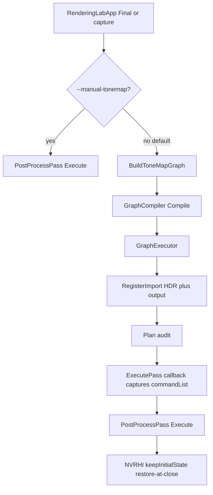

# S5.4 Migrate Tone Mapping

> **For agentic workers:** REQUIRED SUB-SKILL: Use superpowers:subagent-driven-development (recommended) or superpowers:executing-plans to implement this plan task-by-task. Steps use checkbox (`- [ ]`) syntax for tracking.

**Goal:** RDG controls order and resources for tone mapping. `PostProcessPass::Execute` stays the draw. Image comparison (local goldens) passes. CPU dump of the one-pass graph shows one live Raster pass with correct imports/exports.

**Architecture:** NVRHI-free `BuildToneMapGraph` in `RenderLabRdg` (same pattern as `M1ShapedGraph`). `RenderingLabApp` links `RenderLab::RdgExec`, rebuilds GraphBuilder + Compile + GraphExecutor on every tone-map run, `RegisterImport`s HDR + output, `Plan()`s, then `ExecutePass` with `ICommandList*` captured in the callback. `PassContext` unchanged. No `setTextureState`. No GBuffer/Deferred/debug migration.

**Tech Stack:** C++20, CMake preset `windows-vs2022`, `RenderLabDataContractTests` `Check()`, no D3D12 in CI.

**Saved plan (after confirmation only):** [docs/superpowers/plans/2026-09-16-s54-migrate-tone-mapping.md](docs/superpowers/plans/2026-09-16-s54-migrate-tone-mapping.md). Do not start S5.5–S5.7.

---

## Locked grill answers

1. **Ownership:** App owns `RegisterImport` / `Plan` / `ExecutePass` and links `RenderLab::RdgExec`. Shared NVRHI-free `BuildToneMapGraph` in `src/rdg` (like `M1ShapedGraph`). `PostProcessPass` and `RenderLabRenderer` stay RDG-free.
2. **Command list:** Capture `nvrhi::ICommandList*` in the `ExecutePass` callback. `PassContext` stays `GetTexture` / `GetBuffer` only. No new verbs. No `GraphExecutor::Execute(commandList)`. No `AddPass` lambda.
3. **AccessPlan:** `Plan()` is audit-only. No `setTextureState` / `beginTracking` from executor, context, or the tone-map callback. Restores happen at NVRHI command-list close via existing `keepInitialState = true` (HDR: `MakeHDRSceneColorTextureDesc`; swap chain: Donut `DeviceManager_DX12`; dump target: `PostProcessColor`). Leave HDR-capture readback `beginTracking` on its own command list. No second tracker. No FormatMap flip.
4. **Switch:** Default is RDG. CLI `--manual-tonemap` restores today's `PostProcessPass::Execute`. Covers `PresentSource::Final` and `--output-hdr` `final.png`. No HUD. LightingDebug / GBufferDebug stay manual.
5. **Lifetime:** Rebuild GraphBuilder + Compile + GraphExecutor on every tone-map run (each Final frame and each capture). Sequence: `BuildToneMapGraph` → `Compile` → ctor → `RegisterImport` both → `Plan` → `ExecutePass`. Skip `Allocate` (no `Create*`). No rebind verb. Present output = BackBuffer imported+exported Present. Capture output = `PostProcessColor` imported, not exported.
6. **Verification:** CPU ctest = graph shape, one live Raster, imports/exports, AccessPlan, ExecutePass errors. Local GPU = existing `golden.ps1` / `golden-hdr.ps1` Verify on default RDG; `--manual-tonemap` A/B is local, not CI. No D3D12 ctest.
7. **Dump:** `--dump-rdg` stays the M1-shaped 3-pass graph. S5.4 dump proof is CPU `Check()` on `CompileResult::Dump` and `AccessPlan::Dump`. No new CLI, no new golden files.
8. **Tests:** New [tests/test_rdg_tonemap.cpp](tests/test_rdg_tonemap.cpp), CPU-only. Happy path + Plan consumed + UnregisteredImport + wrong handle. Cull N/A. Bit-identical `--manual-tonemap` is local golden, not a `Check()`.
9. **Plan vs ExecutePass:** `ExecutePass` still does not require `Plan()` (S5.1/S5.3 stay green). App and S5.4 happy-path always `Plan()` then `ExecutePass`.
10. **Docs:** [docs/rdg.md](docs/rdg.md), ADR-003 S5.4 extension, README, IMPLEMENTATION_PLAN blurbs. PROGRESS only when complete. Do not edit postprocess.md, hdr-regression.md, m1-reference.md, rdg-dataflow.md, or the S5.3 plan.

---

## Runtime flow



---

## Files

Create:

- [src/rdg/ToneMapGraph.h](src/rdg/ToneMapGraph.h) / [src/rdg/ToneMapGraph.cpp](src/rdg/ToneMapGraph.cpp)
- [tests/test_rdg_tonemap.cpp](tests/test_rdg_tonemap.cpp)

Modify:

- [src/CMakeLists.txt](src/CMakeLists.txt) — add ToneMapGraph to `RENDERLAB_RDG_SOURCES`; `RenderLab` links `RenderLab::RdgExec`
- [tests/CMakeLists.txt](tests/CMakeLists.txt) — add `test_rdg_tonemap.cpp`
- [tests/test_renderer_data.cpp](tests/test_renderer_data.cpp) — declare and call `RunRdgTonemapTests()`
- [src/app/main.cpp](src/app/main.cpp) — `--manual-tonemap` parse + help; `--dump-rdg` unchanged
- [src/app/RenderingLabApp.h](src/app/RenderingLabApp.h) / [src/app/RenderingLabApp.cpp](src/app/RenderingLabApp.cpp) — option + RDG sequence at Present Final and capture `final.png`
- Docs in grill 10 (PROGRESS last, only on complete)

Do not modify: `PostProcessPass` draw/shaders/markers, GBuffer/Deferred/debug passes, `FormatMap` `keepInitialState`, `PassContext`, `CompileResult::Dump` format, `--dump-rdg` M1 graph, goldens, `m1-reference.md`, S5.3 plan.

---

## Types (lock these names)

In [src/rdg/ToneMapGraph.h](src/rdg/ToneMapGraph.h):

```cpp
enum class ToneMapOutput : uint8_t
{
    BackBuffer,
    DumpTarget,
};

struct ToneMapGraph
{
    TextureHandle hdrSceneColor;
    TextureHandle outputImported;
    TextureHandle outputWritten;
    uint32_t postProcessPassIndex = 0;
};

ToneMapGraph BuildToneMapGraph(
    GraphBuilder& builder,
    uint32_t width,
    uint32_t height,
    ToneMapOutput output);
```

Declaration:

- Import `HDRSceneColor` `Format::RGBA16Float` at `width` x `height`.
- Import output: `BackBuffer` + `Format::SRGBA8Unorm` when `ToneMapOutput::BackBuffer`; `PostProcessColor` + `Format::SRGBA8Unorm` when `DumpTarget`.
- `AddPass("PostProcess", PassFlags::Raster)`; `Read(hdr)`; `outputWritten = Write(outputImported)`.
- `ExportTexture(outputWritten)` only for `BackBuffer`.
- Return handles and `PassBuilder::PassIndex()`.

No new GraphExecutor verbs. No `Allocate`. No `SetDevice` on this path.

App sequence (both Final present and capture dump), when `!manualTonemap`:

```cpp
rdg::GraphBuilder builder;
const rdg::ToneMapGraph graph = rdg::BuildToneMapGraph(
    builder, width, height, outputKind);
rdg::exec::GraphExecutor executor(builder, rdg::GraphCompiler::Compile(builder));
executor.RegisterImport(graph.hdrSceneColor, {hdr, "HDRSceneColor"});
executor.RegisterImport(graph.outputImported, {output, outputDebugName});
executor.Plan();
executor.ExecutePass(graph.postProcessPassIndex, [&](rdg::exec::PassContext& ctx) {
    const rdg::exec::PhysicalTexture* hdrPhys = ctx.GetTexture(graph.hdrSceneColor);
    const rdg::exec::PhysicalTexture* outPhys = ctx.GetTexture(graph.outputWritten);
    if (!hdrPhys || !outPhys) { return; }
    const PostProcessPassInputs postInputs = MakePostProcessPassInputs(
        static_cast<nvrhi::ITexture*>(hdrPhys->native), m_tonemapConstants);
    PostProcessPassOutputs postOutputs;
    postOutputs.finalColor = static_cast<nvrhi::ITexture*>(outPhys->native);
    m_postProcessPass.Execute(commandList, postInputs, postOutputs);
});
```

If `executor.GetErrors()` is non-empty after Plan or ExecutePass: `log::error` each error and skip the draw. Do not silently fall back to manual (that is `--manual-tonemap` only).

`--manual-tonemap`: today's two `Execute` call sites unchanged.

---

## Not in S5.4

- S5.5–S5.7; GBuffer, DeferredLighting, LightingDebug, GBufferDebug
- Forking tone-map math, shaders, markers, or golden pixels
- `setTextureState`, second tracker, FormatMap flip, UAV, pooling, `AddPass` execute lambda
- Changing `--dump-rdg`; linking RdgExec into the renderer
- Rewriting frozen contracts; editing the S5.3 plan; PROGRESS until the step is actually done

---

## Build / test commands (every red/green step)

From repo root:

```text
cmake --build --preset windows-debug --target RenderLabDataContractTests
ctest --test-dir out/build/windows-vs2022 -C Debug -R RenderLabDataContractTests --output-on-failure
```

Release before claiming the step done (same target, `-C Release`).

Zero-NVRHI check:

```text
Select-String -Path src/rdg/*.h,src/rdg/*.cpp -Pattern "nvrhi|donut/"
Select-String -Path src/rdg/exec/* -Pattern "donut/"
```

Expected: no matches under `src/rdg/*.h,*.cpp`. No `donut/` under `src/rdg/exec`.

Local GPU (not ctest), after app wiring:

```text
powershell -NoProfile -File scripts\golden.ps1 -Mode Verify -Configuration Debug
powershell -NoProfile -File scripts\golden-hdr.ps1 -Mode Verify -Configuration Debug
```

Optional A/B: capture with and without `--manual-tonemap`; `final.png` must match within the existing 8-bit rule.

---

### Task 1: `BuildToneMapGraph` compile dump (RED then GREEN)

**Files:** [src/rdg/ToneMapGraph.h](src/rdg/ToneMapGraph.h), [src/rdg/ToneMapGraph.cpp](src/rdg/ToneMapGraph.cpp), [src/CMakeLists.txt](src/CMakeLists.txt), [tests/test_rdg_tonemap.cpp](tests/test_rdg_tonemap.cpp), [tests/CMakeLists.txt](tests/CMakeLists.txt), [tests/test_renderer_data.cpp](tests/test_renderer_data.cpp)

- [ ] **Step 1: Write the failing test file**

Suite title `RenderLab S5.4 RDG tone-map tests`. Same `Check` / `HasCategory` harness as [tests/test_rdg_access.cpp](tests/test_rdg_access.cpp).

```cpp
GraphBuilder builder;
const ToneMapGraph graph =
    BuildToneMapGraph(builder, 1280, 720, ToneMapOutput::BackBuffer);
const CompileResult result = GraphCompiler::Compile(builder);
Check(builder.GetErrors().empty() && result.IsSuccess(), "tone-map graph compiles");
Check(result.GetLivePassOrder().size() == 1, "one live pass");
Check(result.GetLivePassOrder()[0] == graph.postProcessPassIndex, "live pass is PostProcess");
const std::string dump = result.Dump();
Check(dump.find("order: [0 \"PostProcess\"]") != std::string::npos, "dump order is PostProcess");
Check(dump.find("2 \"PostProcess\" live root-output") != std::string::npos
          || dump.find("0 \"PostProcess\" live root-output") != std::string::npos,
    "PostProcess is live root-output");
Check(dump.find("read texture") != std::string::npos &&
          dump.find("\"HDRSceneColor\"") != std::string::npos,
    "dump reads HDRSceneColor");
Check(dump.find("write texture") != std::string::npos &&
          dump.find("\"BackBuffer\"") != std::string::npos,
    "dump writes BackBuffer");
Check(dump.find("texture") != std::string::npos &&
          dump.find("\"HDRSceneColor\" imported") != std::string::npos &&
          dump.find("exported") != std::string::npos,
    "HDR imported; BackBuffer imported exported");
```

Assert HDR is imported and **not** exported; BackBuffer is imported **and** exported (split the `find`s so they cannot pass on one resource). `GetResourceCount() == 2`. Pass flags include `Raster`.

- [ ] **Step 2: Run tests — expect FAIL** (missing `BuildToneMapGraph` / file)

`cmake --build --preset windows-debug --target RenderLabDataContractTests`

- [ ] **Step 3: Implement `BuildToneMapGraph`** exactly as Types above. Add sources to `RENDERLAB_RDG_SOURCES`. Wire `RunRdgTonemapTests()` in [tests/test_renderer_data.cpp](tests/test_renderer_data.cpp).

- [ ] **Step 4: Run tests — expect PASS** (`RenderLab S5.4 RDG tone-map tests`, 0 failures). Existing S4 / S5.1–S5.3 banners still appear.

- [ ] **Step 5: Commit** `feat(rdg): add one-pass BuildToneMapGraph for S5.4`

---

### Task 2: AccessPlan before/after/restore (RED then GREEN)

**Files:** [tests/test_rdg_tonemap.cpp](tests/test_rdg_tonemap.cpp)

- [ ] **Step 1: Failing Checks** on the BackBuffer graph (reuse FindBoundary / FindRestore helpers from `test_rdg_access.cpp`, copy locally — do not share a test header):

```cpp
GraphExecutor executor(builder, GraphCompiler::Compile(builder));
Check(executor.GetAccessPlan().Dump() == "access-plan: empty\n", "Dump empty before Plan");
executor.Plan();
Check(executor.GetErrors().empty(), "Plan of tone-map graph succeeds");
const AccessPlan& plan = executor.GetAccessPlan();
const ResourceBoundary* hdr = FindBoundary(plan, "HDRSceneColor");
Check(hdr && hdr->imported && !hdr->exported &&
          hdr->initial == Access::RenderTarget && hdr->final == Access::RenderTarget,
    "HDR imported-only RT/RT");
const ResourceBoundary* bb = FindBoundary(plan, "BackBuffer");
Check(bb && bb->imported && bb->exported &&
          bb->initial == Access::Present && bb->final == Access::Present,
    "BackBuffer imported+exported Present");
CheckReadTransition(FindPassState(plan, "PostProcess", "HDRSceneColor"),
    Access::RenderTarget, Access::ShaderResource, "HDR RT to SR");
CheckWriteTransition(FindPassState(plan, "PostProcess", "BackBuffer"),
    Access::Present, Access::RenderTarget, "BackBuffer Present to RT");
const ResourceRestore* hdrR = FindRestore(plan, "HDRSceneColor");
Check(hdrR && hdrR->from == Access::ShaderResource && hdrR->to == Access::RenderTarget,
    "HDR restore SR to RT");
const ResourceRestore* bbR = FindRestore(plan, "BackBuffer");
Check(bbR && bbR->from == Access::RenderTarget && bbR->to == Access::Present,
    "BackBuffer restore RT to Present");
```

`FindPassState` matches pass name + resource name. Write transition: `mode == Write`, `before == Present`, `required == after == RenderTarget`.

- [ ] **Step 2: Run — FAIL** until helpers exist (or PASS immediately if Task 1 graph already plans correctly — if it PASSES, the Check is still the required proof; do not skip it). If it passes on the first run, that is allowed only because `Plan()` already exists; the new assertions must still be committed as the S5.4 AccessPlan contract.

- [ ] **Step 3:** No executor change expected. If a Check fails, fix `BuildToneMapGraph` flags/export, not `Plan()`.

- [ ] **Step 4: Run — PASS**

- [ ] **Step 5: Commit** `test(rdg): lock S5.4 tone-map AccessPlan rows`

---

### Task 3: ExecutePass resolve, Plan consumed, UnregisteredImport, wrong handle (RED then GREEN)

**Files:** [tests/test_rdg_tonemap.cpp](tests/test_rdg_tonemap.cpp)

- [ ] **Step 1: Failing Checks**

Happy path / Plan consumed:

```cpp
int hdrNative = 1;
int bbNative = 2;
GraphExecutor executor(builder, GraphCompiler::Compile(builder));
executor.RegisterImport(graph.hdrSceneColor, PhysicalTexture{&hdrNative, "HDRSceneColor"});
executor.RegisterImport(graph.outputImported, PhysicalTexture{&bbNative, "BackBuffer"});
executor.Plan();
Check(!executor.GetAccessPlan().passes.empty(), "Plan consumed before ExecutePass");
const PhysicalTexture* gotHdr = nullptr;
const PhysicalTexture* gotOut = nullptr;
executor.ExecutePass(graph.postProcessPassIndex, [&](PassContext& ctx) {
    gotHdr = ctx.GetTexture(graph.hdrSceneColor);
    gotOut = ctx.GetTexture(graph.outputWritten);
});
Check(gotHdr && gotHdr->native == &hdrNative, "PostProcess resolves HDR");
Check(gotOut && gotOut->native == &bbNative, "PostProcess resolves written BackBuffer");
Check(executor.GetErrors().empty(), "registered resolve has no errors");
```

UnregisteredImport:

```cpp
GraphExecutor executor(builder, GraphCompiler::Compile(builder));
executor.Plan();
executor.ExecutePass(graph.postProcessPassIndex, [&](PassContext& ctx) {
    Check(ctx.GetTexture(graph.hdrSceneColor) == nullptr, "unregistered HDR is null");
});
Check(HasCategory(executor.GetErrors(), ErrorCategory::UnregisteredImport),
    "UnregisteredImport on HDR");
```

Wrong / undeclared handle: in the PostProcess callback, `GetTexture` of a default handle and of a foreign-graph handle → `nullptr` + `NullHandle` / `ForeignGraph` (same categories as [tests/test_rdg_exec.cpp](tests/test_rdg_exec.cpp)). Also `GetTexture` of `outputImported` (v0) during the write pass → `SupersededUse`.

- [ ] **Step 2–4:** Implement only if production is missing (should already work). GREEN = new Checks pass; S5.1 still has `ExecutePass without Plan still runs`.

- [ ] **Step 5: Commit** `test(rdg): cover S5.4 ExecutePass import errors`

---

### Task 4: DumpTarget graph (capture leaf) (RED then GREEN)

**Files:** [tests/test_rdg_tonemap.cpp](tests/test_rdg_tonemap.cpp), [src/rdg/ToneMapGraph.cpp](src/rdg/ToneMapGraph.cpp) if BackBuffer-only so far

- [ ] **Step 1: Failing Checks**

```cpp
const ToneMapGraph graph =
    BuildToneMapGraph(builder, 1280, 720, ToneMapOutput::DumpTarget);
const CompileResult result = GraphCompiler::Compile(builder);
Check(result.IsSuccess() && result.GetLivePassOrder().size() == 1, "dump-target graph one live pass");
const std::string dump = result.Dump();
Check(dump.find("\"PostProcessColor\"") != std::string::npos, "output named PostProcessColor");
Check(dump.find("\"PostProcessColor\" imported exported") == std::string::npos,
    "PostProcessColor is not exported");
executor.Plan();
const ResourceBoundary* out = FindBoundary(plan, "PostProcessColor");
Check(out && out->imported && !out->exported &&
          out->initial == Access::RenderTarget && out->final == Access::RenderTarget,
    "dump target imported-only RT");
Check(FindRestore(plan, "PostProcessColor") == nullptr, "dump target needs no restore");
Check(FindRestore(plan, "HDRSceneColor") != nullptr, "HDR still restores SR to RT");
```

- [ ] **Step 3:** `DumpTarget` branch: do not `ExportTexture`. Name `PostProcessColor`.

- [ ] **Step 5: Commit** `feat(rdg): declare capture dump-target tone-map graph`

---

### Task 5: App links RdgExec and runs the sequence (RED then GREEN)

**Files:** [src/CMakeLists.txt](src/CMakeLists.txt), [src/app/RenderingLabApp.h](src/app/RenderingLabApp.h), [src/app/RenderingLabApp.cpp](src/app/RenderingLabApp.cpp)

There is no device in ctest. The RED for this task is Task 3's sequence existing and failing to compile in the app until `RenderLab` links `RenderLab::RdgExec`. After linking, add a private `RenderingLabApp` method that is the sequence in Types (keep `GraphBuilder` in scope for the executor). Call it from:

- [src/app/RenderingLabApp.cpp](src/app/RenderingLabApp.cpp) `PresentSource::Final` (~line 1335) with framebuffer color, `ToneMapOutput::BackBuffer`
- capture `final.png` (~line 970) with `GetOrCreateDumpTarget`, `ToneMapOutput::DumpTarget`

Gate on `m_options.manualTonemap` (added in Task 6; until then always RDG). Width/height from the HDR texture desc (or dump target). Native pointers: `m_hdrSceneColor.GetTexture()` and the output `ITexture*`.

Do not call `SetDevice` or `Allocate`. Do not change `PostProcessPass::Execute`.

- [ ] **Step 4:** Build `RenderLab` Debug. Existing DataContractTests still 0 failures.

- [ ] **Step 5: Commit** `feat(app): execute PostProcess through RDG`

---

### Task 6: `--manual-tonemap` (RED then GREEN)

**Files:** [src/app/main.cpp](src/app/main.cpp), [src/app/RenderingLabApp.h](src/app/RenderingLabApp.h)

- [ ] **Step 1:** No DataContractTests Check for CLI (parser lives in `main.cpp`, not in the test binary). Proof: `--help` lists `--manual-tonemap`. Default remains RDG (`manualTonemap = false`).

Parse like `--verify-lights` (boolean, no value). Help: restores the pre-S5.4 `PostProcessPass::Execute` for on-screen Final and `final.png`; temporary until S5.6; ignored by `--dump-rdg` (CPU exit before device).

When true, both call sites use today's `Execute` directly.

- [ ] **Step 4:** `RenderLab.exe --help` prints the flag. `--dump-rdg` still writes the 3-pass M1 dump and exits 0.

- [ ] **Step 5: Commit** `feat(app): add --manual-tonemap switch for S5.4`

---

### Task 7: Boundary / verify

- [ ] Debug + Release `RenderLabDataContractTests` 0 failures; suite prints `RenderLab S5.4 RDG tone-map tests`; S4 and S5.1–S5.3 still print.
- [ ] `Select-String` zero-NVRHI / no donut in exec (commands above).
- [ ] `git diff --check` clean.
- [ ] `PostProcessPass.cpp` / shaders / `PostProcessContract.h` / goldens / markers unchanged (diff only app wiring + ToneMapGraph + tests + cmake + docs later).
- [ ] `FormatMap` `keepInitialState` still `true`. `PassContext.h` still has no command list.
- [ ] `--dump-rdg` still M1-shaped (compare to [tests/golden/rdg/rdg.txt](tests/golden/rdg/rdg.txt) locally).
- [ ] Local: `golden.ps1` and `golden-hdr.ps1` `-Mode Verify` Debug on default (RDG) path.
- [ ] Do not add a D3D12 ctest.

- [ ] **Commit** only if Task 7 required fixes: `test(rdg): verify S5.4 boundary`

---

### Task 8: Docs (PROGRESS last)

[docs/rdg.md](docs/rdg.md): status S5.4; §1 integration began; §10 retitle S5.1–S5.4 — one-pass leaf, app links RdgExec, callback-captured command list, Plan audit-only, rebuild-each-run, `--manual-tonemap`, `--dump-rdg` still M1.

[docs/adr/ADR-003-rdg-boundary.md](docs/adr/ADR-003-rdg-boundary.md): S5.4 extension — `RenderLabRdg` still NVRHI-free; app schedules PostProcess via Exec; GBuffer/Deferred still manual; keepInitialState remains the one NVRHI path.

[README.md](README.md) and [IMPLEMENTATION_PLAN.md](IMPLEMENTATION_PLAN.md) header blurbs: S5.4 complete, next S5.5. Do not start S5.5.

[docs/PROGRESS.md](docs/PROGRESS.md): **only after** tests are green and local goldens verified — completion block with hashes, commands, known limitations (`--manual-tonemap` temporary; no GBuffer/Deferred migration; Plan not issued; `--dump-rdg` logical M1; PIX local-only). Next step S5.5.

- [ ] **Commit** `docs: record S5.4 tone-map RDG migration`

---

## Self-review

- Grill 1–10 each map to a task (factory, callback command list, audit-only Plan, switch, rebuild sequence, CPU vs local GPU, dump Checks not CLI, new test file, Plan-optional ExecutePass, docs list).
- No placeholders. No GBuffer/Deferred work. TDD: Tasks 1–4 are Check-first; Tasks 5–6 are app integration with the Task 3 sequence as the behavioral spec; Task 7 is the boundary gate.
- Type names used later (`ToneMapGraph`, `ToneMapOutput`, `BuildToneMapGraph`) match Task 1.
