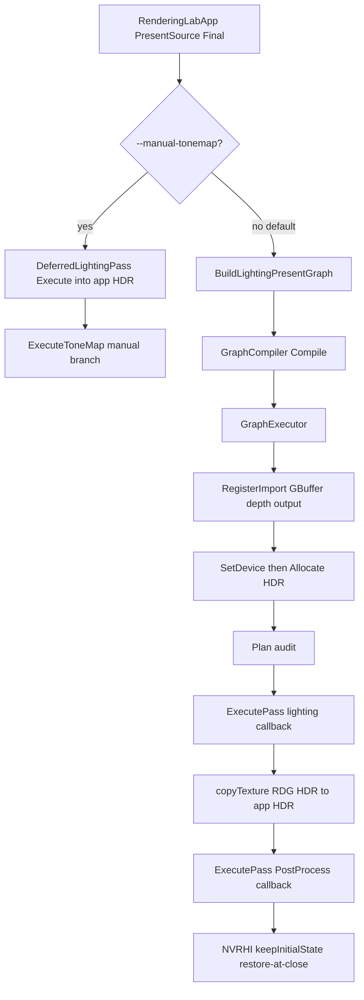

# S5.5 Migrate Deferred Lighting

> **For agentic workers:** REQUIRED SUB-SKILL: Use superpowers:subagent-driven-development (recommended) or superpowers:executing-plans to implement this plan task-by-task. Steps use checkbox (`- [ ]`) syntax for tracking.

**Goal:** RDG owns the lighting-to-present chain. `DeferredLightingPass::Execute` and `PostProcessPass::Execute` stay the draws. Intermediate HDR and `final.png` match existing golden tolerances. Culling and AccessPlan of the runtime graph are visible in CPU Checks.

**Architecture:** New NVRHI-free `BuildLightingPresentGraph` in `RenderLabRdg`. `RenderingLabApp` still owns Compile / GraphExecutor / RegisterImport / Plan / two `ExecutePass` callbacks on one captured `ICommandList*`. HDR is Create*+Allocate (first production Allocate). After lighting, `copyTexture` mirrors HDR into app-owned `HDRSceneColorTarget` so `DumpHdrCapture` is unchanged. `BuildToneMapGraph` stays the S5.4 one-pass leaf (capture `final.png` + `--manual-tonemap` tonemap). Rebuild GraphBuilder + Compile + GraphExecutor every Final run.

**Tech Stack:** C++20, CMake preset `windows-vs2022`, `RenderLabDataContractTests` `Check()`, no D3D12 in CI.

**Saved plan (after confirmation only):** [docs/superpowers/plans/2026-09-16-s55-migrate-deferred-lighting.md](docs/superpowers/plans/2026-09-16-s55-migrate-deferred-lighting.md). Do not start S5.6-S5.7.

**Spec:** This plan is the spec. Locked grill answers below. Do not start S5.6–S5.7.

I'm using the writing-plans skill to create the implementation plan.

---

## Locked grill answers

1. **Factory / ownership:** New NVRHI-free `BuildLightingPresentGraph` in `src/rdg`. Keep `BuildToneMapGraph` as the S5.4 one-pass imported-HDR leaf. `RenderingLabApp` still owns Compile + GraphExecutor + RegisterImport + Plan + ExecutePass. `DeferredLightingPass`, `PostProcessPass`, and `RenderLabRenderer` stay RDG-free.

2. **HDR Create*:** RDG Final path Create*+Allocate HDR and does not draw into `m_hdrSceneColor`. Keep `HDRSceneColorTarget::Create` at resize for LightingDebug, `--manual-tonemap` lighting, and the capture mirror. Do not flip FormatMap (RGBA16Float create-time clear stays `(0,0,0,0)` for GBufferB). Lighting `Execute` still clears `(0,0,0,1)`. Do not run `TextureDescMatchesHDRSceneColorContract` on the Allocate desc.

3. **Command list / versions:** Two `ExecutePass` callbacks capturing the same `ICommandList*` (lighting then tone map). No `GraphExecutor::Execute`. `PassContext` stays GetTexture/GetBuffer only. Factory returns `hdrWritten = lighting.Write(Create*)`. Both callbacks `GetTexture(hdrWritten)`. Create* v0 on the lighting pass is `SupersededUse`.

4. **AccessPlan + Allocate:** `Plan()` stays audit-only (no `setTextureState`). Expected rows use existing `InferAccess`: imported GBufferA/B/C FormatMap RT, lighting Read → SR, restore SR→RT; GBufferDepth FormatMap DepthWrite, lighting Read → SR, restore SR→DepthWrite; Create* HDR FormatMap RT, lighting Write RT, tone-map Read SR, restore SR→RT; BackBuffer imported+exported Present, post Write RT, restore RT→Present. GPU: `SetDevice` then `Allocate` (required for Create* HDR); RegisterImport of GBuffer/depth/output is independent of Allocate order; then Plan; then two ExecutePass. CI `Allocate()` with no `SetDevice` (stubs). Plan still independent of Allocate; ExecutePass still does not require Plan().

5. **Lifetime:** Rebuild GraphBuilder + Compile + GraphExecutor every Final frame (and do not cache). Sequence in Types below. HDR create/destroy each run; pooling is S5.7. No rebind verb.

6. **Switch:** Keep `--manual-tonemap`; widen it to the whole lighting-to-present chain (manual `DeferredLightingPass::Execute` into `m_hdrSceneColor`, then today's `ExecuteToneMap` manual branch). Default: RDG `BuildLightingPresentGraph` for `PresentSource::Final` on-screen. `--output-hdr` `final.png` stays `ExecuteToneMap` of the app HDR mirror (S5.4 leaf). LightingDebug and GBufferDebug stay fully manual including lighting; the flag is ignored there. No `--manual-lighting` / `--manual-rdg`.

7. **Unused LightingDebug cull:** `BuildLightingPresentGraph` declares a LightingDebug Raster pass that Reads GBufferA/B/C/Depth + `hdrWritten` and writes nothing (not NeverCull, no export, no Create* debug color). It culls as `unused-leaf`. App never `ExecutePass` it. `PresentSource::LightingDebug` stays the manual path.

8. **HDR capture:** After RDG lighting `ExecutePass` on Final, `copyTexture` `hdrWritten` → `m_hdrSceneColor` (outside the lighting timer). `DumpHdrCapture` stays: staging readback of app HDR, `lighting-lit.png`, `ExecuteToneMap` for `final.png`. Do not `ExportTexture` HDR. Do not re-run DeferredLighting in the dump (keeps S3.3 frame-1 GPU times). `--manual-tonemap` writes app HDR directly (no copy).

9. **Verification split:** CPU ctest (device-free) = two live Raster passes, imported GBufferA/B/C+depth, Create* HDR not imported, BackBuffer imported+exported, DumpTarget imported-only, LightingDebug culled unused-leaf, AccessPlan rows, Allocate without SetDevice, UnregisteredImport of a GBuffer, ExecutePass(culled LightingDebug)=InvalidPass, Plan-optional ExecutePass still green. Local GPU only = `golden.ps1` + `golden-hdr.ps1` Verify on default RDG; `--manual-tonemap` A/B is local, not a Check(). No D3D12 ctest. CopyTexture is not a CPU Check().

10. **Dump surface:** `--dump-rdg` stays the M1-shaped 3-pass graph. Culling and AccessPlan of `BuildLightingPresentGraph` are visible via CPU Check() on `CompileResult::Dump` and `AccessPlan::Dump`. No new CLI, no new dump golden files.

11. **Tests:** New [tests/test_rdg_lighting.cpp](tests/test_rdg_lighting.cpp), CPU-only. Wire `RunRdgLightingTests()` from [tests/test_renderer_data.cpp](tests/test_renderer_data.cpp). RED/GREEN list is Tasks 1–4.

12. **Docs:** [docs/rdg.md](docs/rdg.md), ADR-003 S5.5 extension, README + IMPLEMENTATION_PLAN blurbs, `main.cpp` `--manual-tonemap` help. PROGRESS only when the step is actually done. Do not rewrite lighting.md, postprocess.md, hdr-regression.md, m1-reference.md, rdg-dataflow.md, or the S5.4 plan.

---

## Runtime flow



Debug present (`LightingDebug` / `GBufferDebug`) never enters this graph: manual lighting into `m_hdrSceneColor`, then the existing debug pass.

---

## Files

Create:

- [src/rdg/LightingPresentGraph.h](src/rdg/LightingPresentGraph.h) / [src/rdg/LightingPresentGraph.cpp](src/rdg/LightingPresentGraph.cpp)
- [tests/test_rdg_lighting.cpp](tests/test_rdg_lighting.cpp)

Modify:

- [src/CMakeLists.txt](src/CMakeLists.txt) — add LightingPresentGraph to `RENDERLAB_RDG_SOURCES`
- [tests/CMakeLists.txt](tests/CMakeLists.txt) — add `test_rdg_lighting.cpp`
- [tests/test_renderer_data.cpp](tests/test_renderer_data.cpp) — declare and call `RunRdgLightingTests()`
- [src/app/main.cpp](src/app/main.cpp) — widen `--manual-tonemap` help
- [src/app/RenderingLabApp.h](src/app/RenderingLabApp.h) / [src/app/RenderingLabApp.cpp](src/app/RenderingLabApp.cpp) — Final RDG sequence + HDR copy
- Docs in grill 12 (PROGRESS last, only on complete)

Do not modify: `DeferredLightingPass` / `PostProcessPass` draw/shaders/markers, GBuffer creation/raster, LightingDebug/GBufferDebug present, `FormatMap` `keepInitialState`, `PassContext`, `CompileResult::Dump` format, `--dump-rdg` M1 graph, goldens, `m1-reference.md`, S5.4 plan, `BuildToneMapGraph`.

---

## Types (lock these names)

Reuse `rdg::ToneMapOutput` from [src/rdg/ToneMapGraph.h](src/rdg/ToneMapGraph.h) (`BackBuffer` vs `DumpTarget`). Do not add a second output enum.

In [src/rdg/LightingPresentGraph.h](src/rdg/LightingPresentGraph.h):

```cpp
struct LightingPresentGraph
{
    TextureHandle gbufferA;
    TextureHandle gbufferB;
    TextureHandle gbufferC;
    TextureHandle gbufferDepth;
    TextureHandle hdrCreated;
    TextureHandle hdrWritten;
    TextureHandle outputImported;
    TextureHandle outputWritten;
    uint32_t deferredLightingPassIndex = 0;
    uint32_t lightingDebugPassIndex = 0;
    uint32_t postProcessPassIndex = 0;
};

LightingPresentGraph BuildLightingPresentGraph(
    GraphBuilder& builder,
    uint32_t width,
    uint32_t height,
    ToneMapOutput output);
```

Declaration order (stable dump indices):

- Import `GBufferA` `SRGBA8Unorm`, `GBufferB` `RGBA16Float`, `GBufferC` `RGBA8Unorm`, `GBufferDepth` `D32Float` at `width` x `height`.
- `hdrCreated = CreateTexture({"HDRSceneColor", width, height, Format::RGBA16Float})`.
- Import output: `BackBuffer` + `SRGBA8Unorm` when `ToneMapOutput::BackBuffer`; `PostProcessColor` + `SRGBA8Unorm` when `DumpTarget`.
- `AddPass("DeferredLighting", PassFlags::Raster)`; Read A/B/C/Depth; `hdrWritten = Write(hdrCreated)`.
- `AddPass("LightingDebug", PassFlags::Raster)`; Read A/B/C/Depth and `hdrWritten`; no Write; not `NeverCull`.
- `AddPass("PostProcess", PassFlags::Raster)`; `Read(hdrWritten)`; `outputWritten = Write(outputImported)`.
- `ExportTexture(outputWritten)` only for `BackBuffer`.

No new GraphExecutor verbs.

App sequence for `PresentSource::Final` when `!manualTonemap` (rebuild every run):

```cpp
rdg::GraphBuilder builder;
const rdg::LightingPresentGraph graph = rdg::BuildLightingPresentGraph(
    builder, width, height, rdg::ToneMapOutput::BackBuffer);
rdg::exec::GraphExecutor executor(builder, rdg::GraphCompiler::Compile(builder));
executor.RegisterImport(graph.gbufferA, {m_gbuffer.GetTexture(GBufferTarget::A), "GBufferA"});
executor.RegisterImport(graph.gbufferB, {m_gbuffer.GetTexture(GBufferTarget::B), "GBufferB"});
executor.RegisterImport(graph.gbufferC, {m_gbuffer.GetTexture(GBufferTarget::C), "GBufferC"});
executor.RegisterImport(graph.gbufferDepth, {m_gbuffer.GetTexture(GBufferTarget::Depth), "GBufferDepth"});
executor.RegisterImport(graph.outputImported, {output, "BackBuffer"});
executor.SetDevice(GetDevice());
executor.Allocate();
executor.Plan();
if (!executor.GetErrors().empty()) { log each; return; }

nvrhi::ITexture* rdgHdr = nullptr;
executor.ExecutePass(graph.deferredLightingPassIndex, [&](rdg::exec::PassContext& ctx) {
    const auto* a = ctx.GetTexture(graph.gbufferA);
    const auto* b = ctx.GetTexture(graph.gbufferB);
    const auto* c = ctx.GetTexture(graph.gbufferC);
    const auto* depth = ctx.GetTexture(graph.gbufferDepth);
    const auto* hdrPhys = ctx.GetTexture(graph.hdrWritten);
    if (!a || !b || !c || !depth || !hdrPhys) { return; }
    rdgHdr = static_cast<nvrhi::ITexture*>(hdrPhys->native);
    DeferredLightingPassInputs lightingInputs;
    lightingInputs.gbufferA = static_cast<nvrhi::ITexture*>(a->native);
    lightingInputs.gbufferB = static_cast<nvrhi::ITexture*>(b->native);
    lightingInputs.gbufferC = static_cast<nvrhi::ITexture*>(c->native);
    lightingInputs.gbufferDepth = static_cast<nvrhi::ITexture*>(depth->native);
    lightingInputs.viewConstants = &m_viewConstants;
    lightingInputs.lightingConstants = &m_lightingConstants;
    DeferredLightingPassOutputs lightingOutputs;
    lightingOutputs.hdrSceneColor = rdgHdr;
    m_deferredLightingPass.Execute(commandList, lightingInputs, lightingOutputs);
});
if (!executor.GetErrors().empty()) { log each; return; }

if (rdgHdr && m_hdrSceneColor.GetTexture())
{
    commandList->copyTexture(
        m_hdrSceneColor.GetTexture(), nvrhi::TextureSlice(),
        rdgHdr, nvrhi::TextureSlice());
}

executor.ExecutePass(graph.postProcessPassIndex, [&](rdg::exec::PassContext& ctx) {
    const auto* hdrPhys = ctx.GetTexture(graph.hdrWritten);
    const auto* outPhys = ctx.GetTexture(graph.outputWritten);
    if (!hdrPhys || !outPhys) { return; }
    const PostProcessPassInputs postInputs = MakePostProcessPassInputs(
        static_cast<nvrhi::ITexture*>(hdrPhys->native), m_tonemapConstants);
    PostProcessPassOutputs postOutputs;
    postOutputs.finalColor = static_cast<nvrhi::ITexture*>(outPhys->native);
    m_postProcessPass.Execute(commandList, postInputs, postOutputs);
});
```

If `executor.GetErrors()` is non-empty after Plan or either ExecutePass: `log::error` each error and skip the remaining draws. Do not silently fall back to manual (that is `--manual-tonemap` only). Do not `ExecutePass(lightingDebugPassIndex)`.

`--manual-tonemap` on Final: today's `DeferredLightingPass::Execute` into `m_hdrSceneColor` plus `ExecuteToneMap` (already takes the manual branch). Debug present: unchanged, including lighting.

`DumpHdrCapture` still readbacks `m_hdrSceneColor` and calls `ExecuteToneMap(..., DumpTarget)` for `final.png`.

Width/height: `m_gbuffer.GetWidth()` / `GetHeight()` (or `m_hdrSceneColor` size; they match after resize).

No `AddPass` execute lambda. No command list on `PassContext`.

---

## Global Constraints

- One numbered step: S5.5 only. Do not start S5.6–S5.7.
- `RenderLabRdg` stays NVRHI-free (ADR-003). Exec may include nvrhi, not donut.
- Do not fork lighting/tone-map math, shaders, markers, or golden pixels.
- Do not migrate GBuffer creation/raster or LightingDebug/GBufferDebug present.
- Frozen contracts stay frozen: lighting.md, postprocess.md, hdr-regression.md, m1-reference.md.
- CI has no GPU. Tests stay `Check()` in `RenderLabDataContractTests`. No gtest.
- `keepInitialState = true` remains the one NVRHI path. Do not flip FormatMap.
- Consume existing `Plan` / `AccessPlan` / `Allocate` / `SetDevice`. No parallel access enum, barrier planner, or allocator.
- `ExecutePass` still does not require `Plan()`.
- Do not edit [docs/superpowers/plans/2026-09-16-s54-migrate-tone-mapping.md](docs/superpowers/plans/2026-09-16-s54-migrate-tone-mapping.md).
- PROGRESS.md only when the step is actually done.

---

## Build / test commands (every red/green step)

From repo root:

```text
cmake --build --preset windows-debug --target RenderLabDataContractTests
ctest --test-dir out/build/windows-vs2022 -C Debug -R RenderLabDataContractTests --output-on-failure
```

Release before claiming the step done (same target, `-C Release`).

Zero-NVRHI check:

```text
Select-String -Path src/rdg/*.h,src/rdg/*.cpp -Pattern "nvrhi|donut/"
Select-String -Path src/rdg/exec/* -Pattern "donut/"
```

Expected: no matches under `src/rdg/*.h,*.cpp`. No `donut/` under `src/rdg/exec`.

Local GPU (not ctest), after app wiring:

```text
powershell -NoProfile -File scripts\golden.ps1 -Mode Verify -Configuration Debug
powershell -NoProfile -File scripts\golden-hdr.ps1 -Mode Verify -Configuration Debug
```

Optional A/B: capture with and without `--manual-tonemap`; `hdr-scene-color.rlhdr` and `final.png` must match within existing rules.

---

### Task 1: `BuildLightingPresentGraph` compile dump (RED then GREEN)

**Files:** [src/rdg/LightingPresentGraph.h](src/rdg/LightingPresentGraph.h), [src/rdg/LightingPresentGraph.cpp](src/rdg/LightingPresentGraph.cpp), [src/CMakeLists.txt](src/CMakeLists.txt), [tests/test_rdg_lighting.cpp](tests/test_rdg_lighting.cpp), [tests/CMakeLists.txt](tests/CMakeLists.txt), [tests/test_renderer_data.cpp](tests/test_renderer_data.cpp)

**Interfaces:**

- Consumes: `GraphBuilder`, `GraphCompiler::Compile`, `ToneMapOutput`
- Produces: `LightingPresentGraph`, `BuildLightingPresentGraph`

- [ ] **Step 1: Write the failing test file**

Suite title `RenderLab S5.5 RDG lighting-present tests`. Same `Check` / `HasCategory` harness as [tests/test_rdg_tonemap.cpp](tests/test_rdg_tonemap.cpp). Copy FindBoundary / FindPassState / FindRestore / CheckReadTransition / CheckWriteTransition helpers locally — do not share a test header.

```cpp
GraphBuilder builder;
const LightingPresentGraph graph =
    BuildLightingPresentGraph(builder, 1280, 720, ToneMapOutput::BackBuffer);
const CompileResult result = GraphCompiler::Compile(builder);
Check(builder.GetErrors().empty() && result.IsSuccess(), "lighting-present graph compiles");
Check(result.GetLivePassOrder().size() == 2, "two live passes");
Check(result.GetLivePassOrder()[0] == graph.deferredLightingPassIndex, "first live is DeferredLighting");
Check(result.GetLivePassOrder()[1] == graph.postProcessPassIndex, "second live is PostProcess");
Check((builder.GetPass(graph.deferredLightingPassIndex).flags & PassFlags::Raster) == PassFlags::Raster,
    "DeferredLighting is Raster");
Check((builder.GetPass(graph.postProcessPassIndex).flags & PassFlags::Raster) == PassFlags::Raster,
    "PostProcess is Raster");
Check(builder.GetResourceCount() == 6, "six textures");

const ResourceRecord& hdr = builder.GetResource(graph.hdrCreated.index);
Check(hdr.name == "HDRSceneColor" && !hdr.imported && !hdr.exported, "HDRSceneColor is Create* not imported");
Check(graph.hdrWritten.index == graph.hdrCreated.index, "hdrWritten is the same slot");
Check(graph.hdrWritten.version != graph.hdrCreated.version, "Write minted a new HDR version");

const ResourceRecord& gbufferA = builder.GetResource(graph.gbufferA.index);
Check(gbufferA.name == "GBufferA" && gbufferA.imported && !gbufferA.exported, "GBufferA imported-only");
const ResourceRecord& depth = builder.GetResource(graph.gbufferDepth.index);
Check(depth.name == "GBufferDepth" && depth.imported && !depth.exported, "GBufferDepth imported-only");
const ResourceRecord& backBuffer = builder.GetResource(graph.outputImported.index);
Check(backBuffer.name == "BackBuffer" && backBuffer.imported && backBuffer.exported,
    "BackBuffer imported and exported");

const std::string dump = result.Dump();
Check(dump.find("0 \"DeferredLighting\" live producer") != std::string::npos,
    "DeferredLighting is live producer");
Check(dump.find("2 \"PostProcess\" live root-output") != std::string::npos,
    "PostProcess is live root-output");
Check(dump.find("texture") != std::string::npos && dump.find("\"HDRSceneColor\"") != std::string::npos,
    "dump names HDRSceneColor");
Check(dump.find("\"HDRSceneColor\" imported") == std::string::npos, "HDR is not imported in dump");
Check(dump.find("texture") != std::string::npos &&
          dump.find("\"BackBuffer\" imported exported") != std::string::npos,
    "dump BackBuffer imported exported");
Check(dump.find("\"GBufferA\" imported") != std::string::npos, "dump GBufferA imported");
Check(dump.find("\"GBufferDepth\" imported") != std::string::npos, "dump GBufferDepth imported");
```

Split imported vs exported finds so they cannot pass on one resource.

- [ ] **Step 2: Run tests — expect FAIL** (missing `BuildLightingPresentGraph` / file)

`cmake --build --preset windows-debug --target RenderLabDataContractTests`

Expected: compile error or link error for `BuildLightingPresentGraph`.

- [ ] **Step 3: Implement `BuildLightingPresentGraph`** exactly as Types above (include the LightingDebug pass so later cull Checks compile; do not assert cull yet). Add sources to `RENDERLAB_RDG_SOURCES`. Wire `RunRdgLightingTests()` in [tests/test_renderer_data.cpp](tests/test_renderer_data.cpp).

- [ ] **Step 4: Run tests — expect PASS** (`RenderLab S5.5 RDG lighting-present tests`, 0 failures). Existing S4 / S5.1–S5.4 banners still appear.

- [ ] **Step 5: Commit** `feat(rdg): add BuildLightingPresentGraph for S5.5`

---

### Task 2: Culled LightingDebug + DumpTarget (RED then GREEN)

**Files:** [tests/test_rdg_lighting.cpp](tests/test_rdg_lighting.cpp), [src/rdg/LightingPresentGraph.cpp](src/rdg/LightingPresentGraph.cpp) if the debug pass or DumpTarget branch is missing

**Interfaces:** Consumes Task 1 factory. Produces cull + DumpTarget compile/access contracts.

- [ ] **Step 1: Failing Checks**

```cpp
const PassCullState* debugCull = nullptr;
for (const PassCullState& state : result.GetPassCullStates())
{
    if (state.passIndex == graph.lightingDebugPassIndex)
    {
        debugCull = &state;
    }
}
Check(debugCull && debugCull->culled && debugCull->reason == CullReason::UnusedLeaf,
    "LightingDebug is culled unused-leaf");
Check(dump.find("1 \"LightingDebug\" culled unused-leaf") != std::string::npos,
    "dump shows LightingDebug unused-leaf");
Check((builder.GetPass(graph.lightingDebugPassIndex).flags & PassFlags::NeverCull) == PassFlags::None,
    "LightingDebug is not NeverCull");
```

DumpTarget:

```cpp
GraphBuilder dumpBuilder;
const LightingPresentGraph dumpGraph =
    BuildLightingPresentGraph(dumpBuilder, 1280, 720, ToneMapOutput::DumpTarget);
const CompileResult dumpResult = GraphCompiler::Compile(dumpBuilder);
Check(dumpResult.IsSuccess() && dumpResult.GetLivePassOrder().size() == 2,
    "dump-target graph two live passes");
const std::string dumpText = dumpResult.Dump();
Check(dumpText.find("\"PostProcessColor\"") != std::string::npos, "output named PostProcessColor");
Check(dumpText.find("\"PostProcessColor\" imported exported") == std::string::npos,
    "PostProcessColor is not exported");
const ResourceRecord& dumpHdr = dumpBuilder.GetResource(dumpGraph.hdrCreated.index);
Check(!dumpHdr.imported, "dump-target HDR is still Create*");
```

- [ ] **Step 2: Run — expect FAIL** until LightingDebug is declared read-only / DumpTarget does not export.

- [ ] **Step 3: Minimal factory fix** if needed. Do not Create* a debug color. Do not Write BackBuffer from LightingDebug.

- [ ] **Step 4: Run — expect PASS**

- [ ] **Step 5: Commit** `test(rdg): lock S5.5 LightingDebug cull and dump-target graph`

---

### Task 3: AccessPlan rows (RED then GREEN)

**Files:** [tests/test_rdg_lighting.cpp](tests/test_rdg_lighting.cpp)

**Interfaces:** Consumes `GraphExecutor::Plan`, `AccessPlan`. No executor change expected.

- [ ] **Step 1: Failing Checks** on the BackBuffer graph

```cpp
GraphExecutor executor(builder, GraphCompiler::Compile(builder));
Check(executor.GetAccessPlan().Dump() == "access-plan: empty\n", "Dump empty before Plan");
executor.Plan();
Check(executor.GetErrors().empty(), "Plan of lighting-present graph succeeds");
const AccessPlan& plan = executor.GetAccessPlan();

const ResourceBoundary* hdr = FindBoundary(plan, "HDRSceneColor");
Check(hdr && !hdr->imported && !hdr->exported && hdr->initial == Access::RenderTarget &&
          hdr->final == Access::RenderTarget,
    "HDR Create* RT/RT");
const ResourceBoundary* bb = FindBoundary(plan, "BackBuffer");
Check(bb && bb->imported && bb->exported && bb->initial == Access::Present &&
          bb->final == Access::Present,
    "BackBuffer imported+exported Present");
const ResourceBoundary* gbufferA = FindBoundary(plan, "GBufferA");
Check(gbufferA && gbufferA->imported && !gbufferA->exported &&
          gbufferA->initial == Access::RenderTarget && gbufferA->final == Access::RenderTarget,
    "GBufferA imported-only RT/RT");
const ResourceBoundary* gbufferDepth = FindBoundary(plan, "GBufferDepth");
Check(gbufferDepth && gbufferDepth->imported &&
          gbufferDepth->initial == Access::DepthWrite && gbufferDepth->final == Access::DepthWrite,
    "GBufferDepth imported-only DepthWrite");

CheckWriteTransition(
    FindPassState(plan, "DeferredLighting", "HDRSceneColor"),
    Access::RenderTarget,
    Access::RenderTarget,
    "HDR lighting write stays RT");
CheckReadTransition(
    FindPassState(plan, "DeferredLighting", "GBufferA"),
    Access::RenderTarget,
    Access::ShaderResource,
    "GBufferA RT to SR");
CheckReadTransition(
    FindPassState(plan, "DeferredLighting", "GBufferDepth"),
    Access::DepthWrite,
    Access::ShaderResource,
    "GBufferDepth DepthWrite to SR");
CheckReadTransition(
    FindPassState(plan, "PostProcess", "HDRSceneColor"),
    Access::RenderTarget,
    Access::ShaderResource,
    "HDR RT to SR at tone map");
CheckWriteTransition(
    FindPassState(plan, "PostProcess", "BackBuffer"),
    Access::Present,
    Access::RenderTarget,
    "BackBuffer Present to RT");

Check(FindPassState(plan, "LightingDebug", "HDRSceneColor") == nullptr,
    "AccessPlan skips culled LightingDebug");

const ResourceRestore* hdrR = FindRestore(plan, "HDRSceneColor");
Check(hdrR && hdrR->from == Access::ShaderResource && hdrR->to == Access::RenderTarget,
    "HDR restore SR to RT");
const ResourceRestore* aR = FindRestore(plan, "GBufferA");
Check(aR && aR->from == Access::ShaderResource && aR->to == Access::RenderTarget,
    "GBufferA restore SR to RT");
const ResourceRestore* depthR = FindRestore(plan, "GBufferDepth");
Check(depthR && depthR->from == Access::ShaderResource && depthR->to == Access::DepthWrite,
    "GBufferDepth restore SR to DepthWrite");
const ResourceRestore* bbR = FindRestore(plan, "BackBuffer");
Check(bbR && bbR->from == Access::RenderTarget && bbR->to == Access::Present,
    "BackBuffer restore RT to Present");
```

Also Plan the DumpTarget graph: `PostProcessColor` imported-only RT, no restore; HDR still restores SR→RT.

- [ ] **Step 2: Run — FAIL** until factory flags/export match (or PASS immediately because `Plan()` already exists; the new assertions are still required proof).

- [ ] **Step 3:** No executor change expected. If a Check fails, fix `BuildLightingPresentGraph` import/export/Create*, not `Plan()`.

- [ ] **Step 4: Run — expect PASS**

- [ ] **Step 5: Commit** `test(rdg): lock S5.5 lighting-present AccessPlan rows`

---

### Task 4: Allocate, resolve, UnregisteredImport, InvalidPass, Plan-optional (RED then GREEN)

**Files:** [tests/test_rdg_lighting.cpp](tests/test_rdg_lighting.cpp)

**Interfaces:** Consumes `SetDevice` (not called), `Allocate`, `RegisterImport`, `ExecutePass`, `GetAllocationStats`.

- [ ] **Step 1: Failing Checks**

Happy path without device (stubs). RegisterImport GBuffer/depth/output, `Allocate()`, `Plan()`, both live `ExecutePass` callbacks `GetTexture(hdrWritten)` and GBuffer reads:

```cpp
int aNative = 1, bNative = 2, cNative = 3, depthNative = 4, bbNative = 5;
GraphExecutor executor(builder, GraphCompiler::Compile(builder));
executor.RegisterImport(graph.gbufferA, PhysicalTexture{&aNative, "GBufferA"});
executor.RegisterImport(graph.gbufferB, PhysicalTexture{&bNative, "GBufferB"});
executor.RegisterImport(graph.gbufferC, PhysicalTexture{&cNative, "GBufferC"});
executor.RegisterImport(graph.gbufferDepth, PhysicalTexture{&depthNative, "GBufferDepth"});
executor.RegisterImport(graph.outputImported, PhysicalTexture{&bbNative, "BackBuffer"});
executor.Allocate();
Check(executor.GetErrors().empty(), "Allocate without SetDevice succeeds");
Check(executor.GetAllocationStats().textureCount == 1, "Allocate one HDR texture");
Check(executor.GetAllocationStats().bufferCount == 0, "Allocate no buffers");
Check(executor.GetAllocationStats().estimatedBytes == 1280ull * 720ull * 8ull, "HDR 8 bpp");
executor.Plan();
const PhysicalTexture* lightingHdr = nullptr;
const PhysicalTexture* lightingA = nullptr;
executor.ExecutePass(graph.deferredLightingPassIndex, [&](PassContext& ctx) {
    lightingA = ctx.GetTexture(graph.gbufferA);
    lightingHdr = ctx.GetTexture(graph.hdrWritten);
    Check(ctx.GetTexture(graph.hdrCreated) == nullptr, "Create* v0 on lighting write is null");
});
Check(lightingA && lightingA->native == &aNative, "lighting resolves GBufferA");
Check(lightingHdr && lightingHdr->native != nullptr && lightingHdr->debugName == "HDRSceneColor",
    "lighting resolves Allocate HDR");
const PhysicalTexture* postHdr = nullptr;
const PhysicalTexture* postOut = nullptr;
executor.ExecutePass(graph.postProcessPassIndex, [&](PassContext& ctx) {
    postHdr = ctx.GetTexture(graph.hdrWritten);
    postOut = ctx.GetTexture(graph.outputWritten);
});
Check(postHdr && lightingHdr && postHdr->native == lightingHdr->native, "tone map reads same HDR native");
Check(postOut && postOut->native == &bbNative, "PostProcess resolves written BackBuffer");
Check(HasCategory(executor.GetErrors(), ErrorCategory::SupersededUse), "SupersededUse on hdrCreated v0");
```

`RegisterImport(graph.hdrCreated, ...)` on a fresh executor is `IncompatibleAccess`.

UnregisteredImport of a GBuffer: omit `RegisterImport` of `gbufferA`, `Allocate()`, `ExecutePass` lighting, `GetTexture(gbufferA) == nullptr`, category `UnregisteredImport`.

Culled debug: `ExecutePass(graph.lightingDebugPassIndex, ...)` does not invoke the callback; category `InvalidPass`.

Plan-optional: skip `Plan()`, `Allocate()` + RegisterImport + `ExecutePass` lighting still resolves HDR (existing S5.1/S5.3 rule, re-proved here).

- [ ] **Step 2–4:** Implement only if production is missing (Allocate/ExecutePass should already work). GREEN = new Checks pass; [tests/test_rdg_exec.cpp](tests/test_rdg_exec.cpp) still has ExecutePass without Plan.

- [ ] **Step 5: Commit** `test(rdg): cover S5.5 Allocate and ExecutePass errors`

---

### Task 5: App runs lighting-to-present through RDG (RED then GREEN)

**Files:** [src/app/RenderingLabApp.h](src/app/RenderingLabApp.h), [src/app/RenderingLabApp.cpp](src/app/RenderingLabApp.cpp)

There is no device in ctest. The behavioral spec is the Task 4 sequence. After CPU tests are green, add a private `RenderingLabApp` helper that is the sequence in Types (keep `GraphBuilder` in scope for the executor).

Call it from [src/app/RenderingLabApp.cpp](src/app/RenderingLabApp.cpp) `PresentSource::Final` when `!m_options.manualTonemap` (today ~lines 1320–1344): skip manual `DeferredLightingPass::Execute` into `m_hdrSceneColor` and skip standalone `ExecuteToneMap`; run the two-pass graph instead.

Gate:

- `m_gbuffer.IsValid() && m_hdrSceneColor.IsValid()` still required (app HDR remains the capture/debug mirror).
- `--manual-tonemap`: keep today's lighting into `m_hdrSceneColor` plus `ExecuteToneMap`.
- `PresentSource::LightingDebug` / `GBufferDebug`: unchanged, including lighting into `m_hdrSceneColor`.

`DumpHdrCapture` still uses `m_hdrSceneColor` + `ExecuteToneMap(..., DumpTarget)`. Do not run `BuildLightingPresentGraph` inside the dump.

Do not change `DeferredLightingPass::Execute` or `PostProcessPass::Execute`. Do not `ExecutePass` the culled LightingDebug index.

- [ ] **Step 4:** Build `RenderLab` Debug. Existing DataContractTests still 0 failures.

- [ ] **Step 5: Commit** `feat(app): execute deferred lighting through RDG`

---

### Task 6: Widen `--manual-tonemap` help (RED then GREEN)

**Files:** [src/app/main.cpp](src/app/main.cpp)

- [ ] **Step 1:** No DataContractTests Check for CLI. Proof: `--help` lists `--manual-tonemap` covering lighting+tonemap.

Help text: temporary A/B that restores pre-S5.5 `DeferredLightingPass::Execute` into app HDR plus `PostProcessPass::Execute` for on-screen Final; `final.png` still goes through `ExecuteToneMap` (manual branch when the flag is set). Default is RDG lighting-to-present on Final. Ignored by `--dump-rdg`. LightingDebug and GBufferDebug stay fully manual including lighting. Removed when S5.6 drops the scheduler.

Parse stays a boolean flag (already exists). Default `manualTonemap = false`.

- [ ] **Step 4:** `RenderLab.exe --help` prints the widened text. `--dump-rdg` still writes the 3-pass M1 dump and exits 0.

- [ ] **Step 5: Commit** `docs(app): widen --manual-tonemap help for S5.5`

---

### Task 7: Boundary / verify

- [ ] Debug + Release `RenderLabDataContractTests` 0 failures; suite prints `RenderLab S5.5 RDG lighting-present tests`; S4 and S5.1–S5.4 still print.
- [ ] `Select-String` zero-NVRHI / no donut in exec (commands above).
- [ ] `git diff --check` clean.
- [ ] `DeferredLightingPass.cpp` / `PostProcessPass.cpp` / shaders / lighting+postprocess contracts / goldens / markers unchanged (diff is app wiring + LightingPresentGraph + tests + cmake + docs later).
- [ ] `FormatMap` `keepInitialState` still `true`. `PassContext.h` still has no command list. FormatMap RGBA16Float create-time clear still `(0,0,0,0)`.
- [ ] GBuffer still app-created (`HDRSceneColorTarget::Create` still runs at resize).
- [ ] `--dump-rdg` still M1-shaped (compare to [tests/golden/rdg/rdg.txt](tests/golden/rdg/rdg.txt) locally).
- [ ] Local: `golden.ps1` and `golden-hdr.ps1` `-Mode Verify` Debug on default (RDG) path. Intermediate HDR and `final.png` match reference tolerances.
- [ ] Do not add a D3D12 ctest.

- [ ] **Commit** only if Task 7 required fixes: `test(rdg): verify S5.5 boundary`

---

### Task 8: Docs (PROGRESS last)

[docs/rdg.md](docs/rdg.md): status S5.5; §10 retitle S5.1–S5.5 — `BuildLightingPresentGraph`, Create*+Allocate HDR, two ExecutePass, HDR copy to app target, culled LightingDebug declare-only, `--manual-tonemap` widened, `--dump-rdg` still M1, Plan audit-only, rebuild-each-run, first production Allocate.

[docs/adr/ADR-003-rdg-boundary.md](docs/adr/ADR-003-rdg-boundary.md): S5.5 extension — `RenderLabRdg` still NVRHI-free; app schedules DeferredLighting then PostProcess via Exec; GBuffer and debug present stay manual; keepInitialState remains the one NVRHI path; FormatMap not flipped; dual HDR (Allocate draw target + app mirror).

[README.md](README.md) and [IMPLEMENTATION_PLAN.md](IMPLEMENTATION_PLAN.md) header blurbs: S5.5 complete, next S5.6. Do not start S5.6.

[docs/PROGRESS.md](docs/PROGRESS.md): **only after** tests are green and local goldens verified — completion block with hashes, commands, known limitations (`--manual-tonemap` temporary and now lighting+tonemap; dual HDR until S5.6; per-frame Allocate; Plan not issued; `--dump-rdg` logical M1; PIX local-only). Next step S5.6.

- [ ] **Commit** `docs: record S5.5 deferred lighting RDG migration`

---

## Not in S5.5

- S5.6–S5.7; GBuffer Create* through RDG; LightingDebug/GBufferDebug present
- Forking lighting/tone-map math, shaders, markers, or golden pixels
- `setTextureState`, second tracker, FormatMap flip, UAV, pooling, `AddPass` execute lambda, `GraphExecutor::Execute`, rebind verb
- Changing `--dump-rdg`; linking RdgExec into the renderer
- Rewriting frozen contracts; editing the S5.4 plan; PROGRESS until the step is actually done

---

## Self-review

- Grill 1–12 each map to a task (factory, HDR Allocate, two ExecutePass + hdrWritten, AccessPlan/Allocate sequence, rebuild-each-run, widened switch, declare-only cull, HDR copy, CPU vs local GPU, dump Checks not CLI, new test file, docs list).
- No placeholders. TDD: Tasks 1–4 are Check-first; Tasks 5–6 are app integration with the Task 4 sequence as the behavioral spec; Task 7 is the boundary gate.
- Type names used later (`LightingPresentGraph`, `BuildLightingPresentGraph`, `hdrWritten`) match Task 1.
- `BuildToneMapGraph` is not grown. `ToneMapOutput` is reused, not duplicated.
